# Sistema de Gestión Integral "Pollito Casero"

## Documento de Especificación de Requisitos de Software y Arquitectura (SRS/SAD)

---

| Campo | Detalle |
|---|---|
| **Proyecto** | Pollito Casero — Sistema de Gestión Logística, Comercial y de Inventario |
| **Documento** | Especificación de Requisitos de Software y Documento de Arquitectura |
| **Código** | PC-SRS-001 |
| **Versión** | 2.0 (Línea base posterior al relevamiento con el cliente) |
| **Fecha de emisión** | 25 de agosto de 2026 |
| **Autor** | Mauro Ponce — Tecnicatura Universitaria en Programación (UTN) |
| **Destinatario** | Cátedra — Trabajo Final Integrador |
| **Marco normativo de referencia** | ISO/IEC/IEEE 29148:2018 (Requirements Engineering) · ISO/IEC 25010 (Calidad del producto software) · Modelo C4 (Documentación de Arquitectura) |
| **Estado** | Especificación actualizada; decisiones pendientes identificadas en la Sección 5 |

### Control de versiones

| Versión | Fecha | Autor | Descripción del cambio |
|---|---|---|---|
| 0.1 | 24/08/2026 | Mauro Ponce | Planteamiento del problema y stack tecnológico preliminar |
| 1.0 | 24/08/2026 | Mauro Ponce | Elaboración integral del SRS: requisitos, reglas de negocio, arquitectura, modelo de datos y plan de trabajo |
| 2.0 | 25/08/2026 | Mauro Ponce | Actualización posterior al relevamiento: galpón como origen sistémico, vehículos como puntos de venta y cajas, integración con balanza/ticadora, rendición de carga, descuentos por faltantes y módulo de cuentas corrientes |

### Nota metodológica sobre el estado de la información

Esta versión incorpora el relevamiento realizado el **25 de agosto de 2026** con el encargado del negocio. La transcripción se utiliza como evidencia primaria para confirmar, refutar o mantener abiertos los supuestos de la línea base 1.0. La guía de relevamiento se utiliza únicamente como instrumento de elicitación y no como fuente de requisitos.

Se aplica la práctica de ingeniería de requisitos de **separar hechos confirmados, inferencias y decisiones pendientes**. Los supuestos originales `SUP-01` a `SUP-16` conservan su identificador para asegurar trazabilidad histórica y reciben un estado explícito en la Sección 5. Las definiciones no respondidas por el cliente permanecen abiertas; no se las convierte en requisitos confirmados. Los nuevos vacíos descubiertos durante el relevamiento se registran como `SUP-17` y `SUP-18`.

Salvo indicación contraria, los términos «sucursal» y «cajero» de la versión 1.0 quedan reemplazados por **punto de venta móvil/vehículo** y **repartidor-cajero**, respectivamente.

---

## Índice

1. Introducción
2. Contexto de negocio y planteamiento del problema
3. Objetivos y criterios de éxito
4. Alcance del sistema
5. Supuestos y restricciones
6. Stakeholders, actores y modelo de roles
7. Modelo de dominio y glosario
8. Requisitos funcionales
9. Reglas de negocio
10. Requisitos no funcionales
11. Casos de uso y flujos de proceso
12. Arquitectura del sistema
13. Modelo de datos
14. Máquinas de estado del dominio
15. Seguridad y control de acceso
16. Infraestructura, despliegue y operación
17. Estrategia de pruebas y calidad
18. Plan de trabajo
19. Gestión de riesgos
20. Matriz de trazabilidad
21. Evolución futura (post-MVP)
22. Anexos

---

# 1. Introducción

## 1.1 Propósito del documento

El presente documento especifica de manera formal, completa y verificable los requisitos funcionales, no funcionales y arquitectónicos del sistema **Pollito Casero**. Constituye la línea base contractual entre el equipo de desarrollo y la organización cliente, y cumple una doble función:

- **Función académica:** entrega evaluable del Trabajo Final Integrador, demostrando dominio del ciclo de vida del software desde la elicitación hasta el plan de despliegue.
- **Función productiva:** documento rector para la construcción y puesta en producción real del sistema en la organización.

## 1.2 Audiencia

| Audiencia | Uso esperado del documento |
|---|---|
| Cátedra evaluadora | Verificar la aplicación de metodologías de ingeniería de software |
| Gerencia de la organización | Validar que el alcance responde a la problemática de negocio |
| Equipo de desarrollo | Fuente única de verdad para la construcción del sistema |
| Usuarios clave (encargados) | Validar reglas de negocio y flujos operativos |

## 1.3 Convenciones de identificación

| Prefijo | Significado |
|---|---|
| `RF-` | Requisito Funcional |
| `RNF-` | Requisito No Funcional |
| `RN-` | Regla de Negocio |
| `CU-` | Caso de Uso |
| `SUP-` | Supuesto/decisión de elicitación con estado de validación |
| `RES-` | Restricción |
| `RG-` | Riesgo |
| `ADR-` | Architecture Decision Record |

**Prioridad de requisitos (MoSCoW):** `M` (Must have — obligatorio para el MVP), `S` (Should have), `C` (Could have), `W` (Won't have en esta iteración).

## 1.4 Referencias normativas y técnicas

- ISO/IEC/IEEE 29148:2018 — *Systems and software engineering: Life cycle processes — Requirements engineering*.
- ISO/IEC 25010:2011 — *Systems and software Quality Requirements and Evaluation (SQuaRE)*.
- Ley N.º 25.326 de Protección de los Datos Personales (República Argentina).
- Brown, S. — *The C4 model for visualising software architecture*.
- Fowler, M. — *Patterns of Enterprise Application Architecture*.

---

# 2. Contexto de negocio y planteamiento del problema

## 2.1 Caracterización de la organización

La organización opera bajo un modelo de **integración vertical** en la industria avícola: producción primaria en granja, faena y acondicionamiento, consolidación operativa en un galpón y distribución/comercialización mediante flota propia.

El relevamiento confirmó que **no existen sucursales físicas**. La venta se realiza durante los recorridos: cada una de las cinco a siete camionetas que salen por día funciona como **punto de venta móvil**, y el repartidor actúa además como cajero responsable de su vehículo. Existen seis repartidores identificados para la operación habitual y el despacho comienza aproximadamente a las 05:00.

La granja no dispone de conectividad a internet y el galpón sí. Por ello, el **galpón es el origen sistémico y autoritativo de los datos operativos**: allí se preparan las cargas, se emiten los remitos, se controla el peso y se reciben las rendiciones al regreso. La granja permanece como origen físico de producción, fuera del circuito transaccional en línea del MVP.

## 2.2 Descripción de la problemática (situación As-Is)

El diagnóstico del ecosistema de gestión actual identifica una **deficiencia estructural en los flujos de información**, caracterizada por la ausencia de trazabilidad entre la carga preparada en el galpón, la mercadería transportada en cada vehículo, las entregas a clientes y la rendición final del repartidor.

Los procesos se ejecutan de forma fragmentada y sobre **silos de datos** no interconectados. Concretamente:

- Los remitos se completan en el **galpón** y se conservan en soporte papel; queda una copia en el galpón y otra en el cliente.
- La comunicación logística de novedades, faltantes y ajustes se canaliza mediante **mensajería instantánea (WhatsApp)**, un medio sin persistencia relacional, sin capacidad de consulta agregada y con alta probabilidad de pérdida de información crítica.
- Las ventas y saldos se anotan en **cuadernos**; el control de mercadería se apoya en balanza y conteo de cajas.
- La balanza conectada a una **ticadora** emite el peso en kilogramos para adherirlo al conjunto pesado, pero esa lectura no se integra aún a un registro transaccional central.
- Cada vehículo sale normalmente con diez a quince boletas. Al regreso se suman sus importes y se comparan con efectivo, cheques, transferencias, saldos en cuenta corriente y mercadería no entregada.
- Los faltantes de mercadería o de dinero se imputan al repartidor. La decisión sobre si una diferencia constituye merma normal o faltante se toma después del control de peso en el galpón, por el encargado de reparto y/o la dirección, con apoyo del grupo de mensajería.
- La mayoría de las ventas mayoristas opera mediante **cuenta corriente**, sin un módulo estructurado de deuda y cobranzas.

### 2.2.1 Diagrama del flujo actual (As-Is)

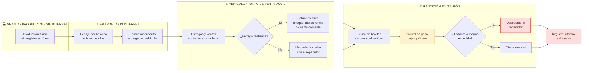

## 2.3 Impacto operativo y comercial

La carencia de integración sistémica genera fricciones cuantificables en la operación diaria:

| # | Fricción identificada | Manifestación operativa | Impacto económico |
|---|---|---|---|
| P-01 | **Desfasajes de inventario por vehículo** | Diferencias entre cajas/kilos cargados, entregados, devueltos y pesados al regreso | Imposibilidad de separar merma tolerada de pérdida imputable |
| P-02 | **Fricción administrativa en reparto** | Conciliación manual de remitos, boletas, devoluciones, cajas retornables y rutas | Horas-hombre administrativas improductivas |
| P-03 | **Opacidad financiera por repartidor** | La caja de cada vehículo se reconstruye sumando boletas y mensajes | Decisiones gerenciales sobre información diferida; faltantes de caja |
| P-04 | **Ausencia de auditabilidad** | Imposibilidad de reconstruir quién cargó, pesó, entregó, cobró o rindió una operación | Riesgo de faltantes no detectados o mal atribuidos |
| P-05 | **Volatilidad del conocimiento operativo** | La información reside en el canal de mensajería y en la memoria del personal | Dependencia crítica de personas específicas |
| P-06 | **Imposibilidad de generar métricas** | No existe base de datos histórica explotable | Nula capacidad de planificación de producción basada en demanda |
| P-07 | **Cuentas corrientes no sistematizadas** | La mayoría de los clientes mayoristas paga después y el saldo se controla de forma manual | Riesgo de deuda omitida, cobranza tardía y saldos incorrectos |
| P-08 | **Captura de peso desacoplada** | La ticadora imprime kilos, pero el dato no queda vinculado digitalmente a la carga | Doble carga, error de transcripción y menor control de la merma |

## 2.4 Justificación de la solución

Resulta imperativo el desarrollo e implementación de un **sistema de información centralizado** que automatice la conciliación de la carga por vehículo, estandarice la emisión de remitos desde el galpón, integre las lecturas de peso de la ticadora, registre las entregas y ventas móviles, y unifique la rendición de mercadería, caja y cuentas corrientes.

La digitalización propuesta no persigue únicamente la mitigación de pérdidas por desajustes administrativos: su objetivo estructural es dotar a la empresa de una **arquitectura de información escalable**, capaz de sostener la operación simultánea de cinco a siete puntos de venta móviles sin degradación del control, y de constituir el sustrato de datos necesario para futuras capacidades analíticas.

## 2.5 Situación objetivo (To-Be)

El sistema propuesto reduce la informalidad mediante la **digitalización de la carga en el galpón**, la captura de cajas y kilogramos, el registro móvil de cada entrega y la **rendición integral por vehículo**, garantizando una **única fuente de verdad (Single Source of Truth)** para toda la organización.

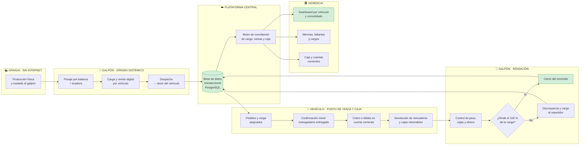

### 2.5.1 Cuadro comparativo As-Is / To-Be

| Dimensión | Situación actual (As-Is) | Situación objetivo (To-Be) |
|---|---|---|
| Soporte del remito | Papel emitido en el galpón | Registro digital en galpón, con respaldo A4 y copia para el cliente |
| Captura de peso | Ticket de ticadora no integrado | Lectura en kilogramos asociada a la carga, producto, operador y vehículo |
| Confirmación de entrega | Comunicación al regreso o por mensajería | Confirmación móvil de entrega, no entrega, cobro, transferencia o cuenta corriente |
| Tratamiento de faltantes | Evaluación posterior e imputación manual al repartidor | Discrepancia tipificada, tolerancia de merma y cargo monetario auditable |
| Visibilidad del stock | Estimada y diferida | Consolidada en galpón y discriminada por vehículo |
| Estado de la carga | Sin representación digital | Modelado explícitamente desde preparación hasta rendición |
| Cierre de caja | Suma manual de boletas por repartidor | Arqueo digital por vehículo y repartidor, desglosado por medio de pago |
| Cuentas corrientes | Saldos manuales en cuaderno/grupo | Débitos, cobranzas, saldos y extractos por cliente mayorista |
| Consolidación gerencial | Manual, semanal o mensual | Automática, disponible en tiempo real |
| Auditabilidad | Nula | Bitácora inmutable de eventos por usuario y timestamp |
| Base para analítica | Inexistente | Serie histórica estructurada desde el día uno |

---

# 3. Objetivos y criterios de éxito

## 3.1 Objetivo general

Desarrollar e implantar un sistema de información web centralizado que garantice la trazabilidad íntegra de la mercadería desde su registro en el galpón hasta la rendición de cada vehículo, y que provea a la gerencia visibilidad consolidada del inventario, las mermas, las cajas por repartidor y las cuentas corrientes de clientes.

## 3.2 Objetivos específicos

| ID | Objetivo específico | Requisitos asociados |
|---|---|---|
| OE-01 | Digitalizar el ciclo completo de carga y remito, desde su emisión en el galpón hasta la rendición del vehículo | RF-100 a RF-134 |
| OE-02 | Establecer un modelo de inventario en tiempo real con stock explícito por galpón y vehículo | RF-200 a RF-218 |
| OE-03 | Tipificar y sistematizar el tratamiento de diferencias, mermas y faltantes imputables | RF-120 a RF-126, RF-414 a RF-418 |
| OE-04 | Registrar las entregas y ventas móviles con impacto automático sobre el stock del vehículo | RF-300 a RF-316 |
| OE-05 | Implementar el arqueo diario por vehículo y repartidor con rendición integral de carga y valores | RF-400 a RF-419 |
| OE-06 | Proveer consolidación gerencial por vehículo y global de inventario, caja, mermas y cuentas corrientes | RF-500 a RF-511, RF-700 a RF-708 |
| OE-07 | Garantizar la auditabilidad íntegra mediante bitácora de eventos | RF-600 a RF-604 |
| OE-08 | Construir una arquitectura desplegable, contenerizada y escalable horizontalmente | RNF-40 a RNF-49 |
| OE-09 | Integrar la balanza/ticadora para evitar la transcripción manual del peso de la carga | RF-129 a RF-134 |

## 3.3 Criterios de éxito e indicadores

| Indicador | Situación base (estimada) | Meta a 6 meses de la implantación |
|---|---|---|
| Porcentaje de cargas/remitos emitidos digitalmente desde el galpón | 0 % | ≥ 95 % |
| Lecturas de peso disponibles integradas sin reingreso manual | 0 % | ≥ 95 % |
| Recorridos con rendición del 100 % de la carga | No mensurable | 100 % conciliados o con diferencia/cargo registrado |
| Diferencias de carga, merma y caja detectadas y clasificadas | No mensurable | 100 % registradas y clasificadas |
| Latencia de disponibilidad del arqueo consolidado | Diferida (días) | < 15 minutos tras el cierre del último vehículo |
| Diferencia de inventario no explicada (mensual) | No mensurable | Reducción medible y atribuible por causa |
| Ventas a cuenta corriente con saldo actualizado | Registro manual | 100 % de las ventas financiadas registradas |
| Adopción por usuarios operativos | — | ≥ 90 % de operaciones registradas en el sistema |

> **Nota metodológica:** los valores de la columna "situación base" no pueden cuantificarse en el estado actual precisamente porque el problema que el sistema resuelve es la ausencia de medición. Se establece por tanto que **el primer mes de operación productiva constituye el período de captura de la línea base real**, contra la cual se evaluarán las metas.

---

# 4. Alcance del sistema

## 4.1 Alcance incluido en el MVP

El producto mínimo viable comprende siete módulos funcionales:

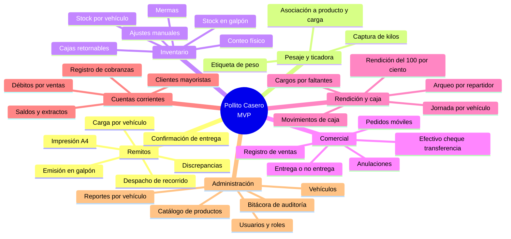

## 4.2 Exclusiones explícitas del MVP

La delimitación negativa del alcance es tan relevante como la positiva. Las siguientes funcionalidades **no forman parte** de esta iteración, y su exclusión es una decisión deliberada de diseño, no una omisión:

| ID | Funcionalidad excluida | Fundamento de la exclusión |
|---|---|---|
| EX-01 | Facturación electrónica ARCA/AFIP | Alta complejidad regulatoria y de certificación; el MVP es un sistema de gestión interna. El modelo de datos se diseña, no obstante, previendo su incorporación. |
| EX-02 | Liquidación de haberes y control de asistencia | Dominio funcional ajeno al problema planteado |
| EX-03 | Integración con sistemas contables de terceros | Requiere definición previa del sistema contable en uso |
| EX-04 | Comercio electrónico y pedidos de clientes finales | Fuera del problema de trazabilidad interna |
| EX-05 | Planificación predictiva de producción | Requiere serie histórica que el propio MVP generará |
| EX-06 | Gestión sanitaria y de lotes según normativa SENASA | Requiere relevamiento normativo específico |
| EX-07 | Aplicación móvil nativa | Se resuelve mediante diseño web responsivo |
| EX-08 | Operación transaccional en línea desde la granja | La granja no tiene internet; el alta de datos comienza en el galpón conectado. Ver SUP-09 y ADR-05 |
| EX-09 | Liquidación automática de descuentos en haberes | El sistema registra y autoriza el cargo al repartidor, pero no liquida nómina. Ver EX-02 |
| EX-10 | Compensación y acreditación bancaria automática de cheques o transferencias | El MVP registra y concilia estos valores de forma manual |

## 4.3 Límites del sistema (diagrama de contexto)

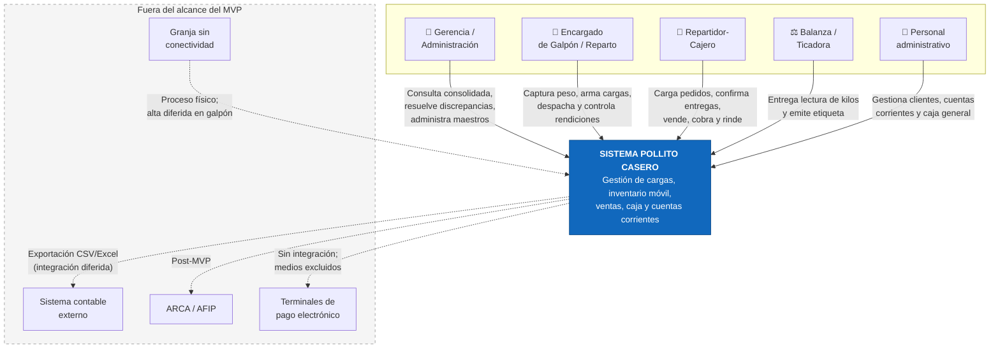

---

# 5. Supuestos y restricciones

## 5.1 Matriz de resolución de supuestos

La tabla conserva los identificadores de la línea base 1.0. Los estados utilizados son: **Confirmado**, **Confirmado con modificación**, **Refutado**, **Parcialmente confirmado** y **Pendiente**. Solo los dos primeros convierten el supuesto en una decisión validada; los estados parcial y pendiente continúan requiriendo definición.

| ID | Enunciado de la v1.0 | Estado v2.0 | Evidencia del relevamiento y decisión incorporada | Impacto / acción |
|---|---|---|---|---|
| SUP-01 | Transferencia por caja con peso asociado; doble unidad cajas/kg. | **Confirmado** | El cliente indicó que despacha «por las dos cosas» y controla mediante balanza. | El modelo usa simultáneamente cantidad de cajas y peso en kg. Ver RF-102, RF-103 y RF-129 a RF-134. |
| SUP-02 | Catálogo del orden de decenas de SKU. | **Parcialmente confirmado** | Se venden productos derivados del pollo, pero no se informó la lista ni la cantidad exacta. | El catálogo queda sin límite técnico; se requiere inventario de SKU antes de la carga de maestros. |
| SUP-03 | No se exige trazabilidad por lote individual en el MVP. | **Pendiente** | La entrevista no preguntó ni confirmó lote o fecha de faena. | Se mantiene fuera del MVP como supuesto de diseño; revalidar antes del modelo definitivo. |
| SUP-04 | Aceptación parcial en una sucursal con discrepancia abierta. | **Refutado** | No existen sucursales físicas. La mercadería se carga en vehículos; lo no entregado regresa y las diferencias se evalúan en el galpón después del control de peso. | Se reemplaza la recepción por **rendición de recorrido y carga**. Ver RF-414 a RF-419 y RN-20 a RN-25. |
| SUP-05 | Se admiten diferencias positivas y generan discrepancia. | **Pendiente** | La pregunta sobre sobrantes no recibió respuesta en la transcripción. | El modelo admite sobrantes para no perder información, pero su política de resolución queda pendiente. |
| SUP-06 | Un remito despachado no es editable; se corrige por anulación/devolución. | **Pendiente** | No fue tratado en la entrevista. | Se conserva como control de integridad de la v1.0 hasta validación expresa. |
| SUP-07 | El stock se descuenta al registrar la venta. | **Parcialmente confirmado** | El cliente requiere que el repartidor confirme en el programa qué entregó y qué no entregó; no definió el instante contable exacto. | Se adopta descuento al confirmar entrega/venta y reversión por anulación; requiere confirmación de aceptación. |
| SUP-08 | Tolerancia de merma parametrizable con valor inicial 2 %. | **Confirmado con modificación** | Ejemplo explícito: en 100 kg pueden faltar 3 kg, pero no 20 kg. | La tolerancia operativa inicial se fija en **3 % del peso cargado por recorrido**. Toda diferencia se registra; el exceso genera revisión y cargo. |
| SUP-09 | Internet mayormente disponible en sucursales; sin offline pleno. | **Refutado y reformulado** | La granja no tiene internet; el galpón sí. No existen sucursales. Ante caída se aplica plan B manual y carga posterior. | El galpón pasa a ser origen de datos. La granja queda fuera del circuito en línea. Los móviles usan conectividad disponible y contingencia manual. Ver ADR-05. |
| SUP-10 | Navegadores modernos en PC o móviles de gama media. | **Confirmado** | Repartidores usarán celular; el galpón usará computadora y, opcionalmente, celular. | Se mantiene aplicación web responsiva para móvil y escritorio. |
| SUP-11 | Credenciales individuales. | **Confirmado** | El cliente exigió que cada persona tenga su usuario para no mezclar operaciones. | Requisito obligatorio; cada acción queda atribuida al operador. |
| SUP-12 | Efectivo, débito, crédito, transferencia y billetera virtual. | **Refutado** | Medios actuales: **efectivo, cheque y transferencia**. No se usan débito ni crédito. | Se eliminan tarjetas y billeteras del MVP. Ver RF-306 y RN-35. |
| SUP-13 | No se requiere cuenta corriente en el MVP. | **Refutado** | La mayoría de los clientes mayoristas opera a cuenta corriente. | Se incorpora el módulo de Cuentas Corrientes como obligatorio. Ver RF-700 a RF-708. |
| SUP-14 | Una granja como origen de despacho. | **Refutado y reformulado** | El remito se llena en el galpón y el flujo operativo es galpón → vehículo. | El **galpón** es el único origen sistémico confirmado del MVP; la granja es origen físico no conectado. |
| SUP-15 | Cierre por jornada y sucursal, con múltiples cajeros. | **Refutado y reformulado** | Cada repartidor es cajero de su vehículo y rinde al regreso. | La jornada y el arqueo se definen por **fecha + vehículo + repartidor**. Ver RF-400 a RF-419. |
| SUP-16 | Infraestructura en planes gratuitos o de entrada. | **Pendiente** | El presupuesto no fue tratado en la entrevista. | Mantener como restricción provisional y revalidar antes del despliegue productivo. |
| SUP-17 | Interfaz técnica de la balanza/ticadora. | **Nuevo - Pendiente** | Se confirmó el uso de la ticadora para obtener e imprimir kilos, pero no se informó marca, modelo, protocolo o formato de datos. | Realizar prueba técnica de integración antes del Sprint de pesaje; admitir captura manual controlada como contingencia. |
| SUP-18 | Criterio monetario de valuación de faltantes imputados al repartidor. | **Nuevo - Pendiente** | Se confirmó que el faltante se descuenta, pero no si se valúa a costo, precio mayorista u otro importe. | El sistema registrará un importe autorizado; la fórmula automática queda pendiente y parametrizable. |

> **Decisiones todavía abiertas que no deben inferirse:** lista exacta de SKU, trazabilidad por lote, política ante sobrantes, inmutabilidad del remito despachado, instante contable definitivo del descuento de stock, presupuesto de infraestructura, interfaz de la ticadora y base de valuación de los cargos al repartidor.

## 5.2 Restricciones del proyecto

| ID | Restricción | Naturaleza |
|---|---|---|
| RES-01 | Stack tecnológico predefinido: React + TypeScript + Tailwind CSS en frontend; Java con Spring Boot en backend; PostgreSQL como motor de persistencia | Técnica (decisión tomada) |
| RES-02 | Despliegue en proveedores de nube con capa gratuita o de bajo costo (Vercel para frontend; Render/Railway para backend) | Presupuestaria |
| RES-03 | Contenerización obligatoria mediante Docker para homogeneizar entornos de desarrollo | Técnica |
| RES-04 | El sistema debe operar sin interrumpir la salida de los repartos ni la venta durante su implantación | Operativa |
| RES-05 | El proyecto debe completarse dentro del calendario académico del Trabajo Final Integrador | Temporal |
| RES-06 | El tratamiento de datos personales de clientes queda sujeto a la Ley N.º 25.326 | Legal |
| RES-07 | La interfaz de reparto debe ser plenamente operable desde teléfonos móviles, incluso con conectividad inestable | Ergonómica |
| RES-08 | El alta transaccional de cargas y remitos comienza en el galpón; la granja no constituye un punto de operación en línea del MVP | Operativa / conectividad |
| RES-09 | El procedimiento manual de contingencia debe permitir registrar operaciones y cargarlas posteriormente sin duplicación | Operativa |

---

# 6. Stakeholders, actores y modelo de roles

## 6.1 Identificación de stakeholders

| Stakeholder | Interés principal | Influencia | Estrategia de gestión |
|---|---|---|---|
| Gerencia / Propiedad | Visibilidad financiera y reducción de pérdidas | Alta | Involucramiento en validación de reportes |
| Encargado de galpón / reparto | Agilidad en pesaje, armado de carga, despacho y control de la rendición | Alta | Diseño de UI optimizado para la operación de las 05:00 y conciliación rápida |
| Repartidores-cajeros | Registrar pedidos, entregas y cobranzas con baja fricción; conocer su rendición | Alta | Flujo móvil breve, estado visible del recorrido y resumen previo al cierre |
| Administración / cobranzas | Mantener saldos de clientes y registrar cobros | Alta | Extractos simples, trazabilidad y filtros por cliente/repartidor |
| Personal de granja | Continuidad del proceso físico aun sin internet | Media | Mantenerlo fuera de la operación transaccional en línea; coordinación con el galpón |
| Clientes mayoristas | Exactitud de saldos, entregas y comprobantes | Media | Comprobante A4 y extracto de cuenta verificable |
| Cátedra evaluadora | Rigor metodológico | Alta (académica) | Documentación conforme a estándares |

## 6.2 Actores del sistema

| Actor | Descripción | Ámbito de datos |
|---|---|---|
| **Administrador** | Configura el sistema, gestiona usuarios y maestros | Global |
| **Gerencia** | Consulta consolidada, resuelve discrepancias, autoriza excepciones | Global |
| **Encargado de Galpón / Reparto** | Registra pesajes, arma y despacha cargas, controla devoluciones, mermas y rendiciones | Galpón y vehículos operativos |
| **Repartidor-Cajero** | Gestiona pedidos y entregas, registra ventas/cobros y rinde mercadería y valores de su vehículo | Vehículo y recorrido asignados |
| **Administración / Cobranzas** | Gestiona clientes, cuentas corrientes, cobranzas y movimientos de caja general | Comercial y financiero autorizado |
| **Balanza/Ticadora** *(sistema externo)* | Proporciona la lectura de peso y/o impresión de etiqueta para la carga | Interfaz técnica pendiente en SUP-17 |
| **Auditor** *(rol de solo lectura)* | Consulta histórica sin capacidad de modificación | Global, solo lectura |

## 6.3 Matriz de permisos (RBAC)

Leyenda: **C** Crear · **L** Leer · **M** Modificar · **A** Anular/Eliminar · **X** Autorizar · **—** Sin acceso

| Funcionalidad | Admin | Gerencia | Enc. Galpón | Repartidor-Cajero | Adm./Cobranzas | Auditor |
|---|:--:|:--:|:--:|:--:|:--:|:--:|
| Gestión de usuarios y roles | C L M A | L | — | — | — | L |
| Catálogo de productos | C L M A | C L M | L | L | L | L |
| Gestión de vehículos | C L M A | C L M | L | L¹ | L | L |
| Gestionar clientes | C L M | L | L | L¹ | C L M | L |
| Capturar/validar peso de ticadora | L | L | C L M | L¹ | — | L |
| Emitir y despachar carga/remito | C L | L | C L M | L¹ | — | L |
| Confirmar entrega o no entrega | L | L | L | C L M¹ | L | L |
| Registrar venta y cobro | L | L | L | C L M¹ | C L | L |
| Registrar venta a cuenta corriente | L | L | L | C L¹ | C L M | L |
| Registrar devolución de mercadería/cajas | L | L | C L M | C L¹ | — | L |
| Resolver discrepancia o merma | L | X | C L M³ | L¹ | — | L |
| Consultar stock del vehículo | L | L | L | L¹ | — | L |
| Consultar stock consolidado | L | L | L | — | — | L |
| Ajuste manual de stock | C L | X | C L M³ | — | — | L |
| Abrir jornada de vehículo | L | L | C | L¹ | — | L |
| Registrar rendición de valores | L | L | C L M | C L¹ | C L M | L |
| Cerrar arqueo sin diferencia | L | L | C | L¹ | L | L |
| Cerrar con cargo al repartidor | L | X | C³ | L¹ | L | L |
| Registrar cobranza de cuenta corriente | L | L | L | C L¹ | C L M | L |
| Consultar cuenta corriente | L | L | L | L¹ | C L | L |
| Reportes por vehículo | L | L | L | L¹ | L | L |
| Reportes consolidados / flujo de caja | L | L | L | — | L | L |
| Bitácora de auditoría | L | L | — | — | — | L |
| Parámetros del sistema | C L M | L | — | — | — | L |

**Notas de la matriz**

1. Restringido al vehículo/recorrido asignado o a los clientes atendidos en ese recorrido.
2. La balanza/ticadora actúa como sistema externo y no recibe permisos de negocio; su lectura es validada por un usuario autenticado.
3. Requiere autorización de Gerencia conforme a RN-40.

> El modelo adoptado es **RBAC con segregación por vehículo y recorrido**: el rol define *qué* acciones puede ejecutar un usuario, y la asignación operativa define *sobre qué vehículo, carga y clientes* puede ejecutarlas. Ambas dimensiones se evalúan en toda petición.

---

# 7. Modelo de dominio y glosario

## 7.1 Glosario de términos del dominio

| Término | Definición operativa |
|---|---|
| **Galpón** | Nodo operativo conectado donde se originan los datos del MVP: pesaje, armado de carga, emisión de remitos, despacho y rendición. |
| **Vehículo / punto de venta móvil** | Camioneta con stock, recorrido y caja propios. Reemplaza el concepto de sucursal física de la v1.0. |
| **Carga de reparto** | Conjunto de mercadería, expresado en cajas y kilogramos, asignado a un vehículo y repartidor para una jornada. |
| **Remito** | Documento emitido en el galpón que respalda la carga y/o entrega de mercadería; posee respaldo A4 y trazabilidad digital. |
| **Ítem de carga/remito** | Línea de producto con cajas declaradas, peso capturado y resultado final: vendido/entregado, devuelto, merma o faltante. |
| **Lectura de peso** | Registro de kilogramos proveniente de la balanza/ticadora o, en contingencia, ingresado manualmente con motivo y operador. |
| **Stock del vehículo** | Mercadería bajo responsabilidad del repartidor desde el despacho hasta la rendición del recorrido. |
| **Discrepancia** | Diferencia entre la carga declarada y su rendición, o entre valores esperados y rendidos. |
| **Merma** | Pérdida de producto por causas propias del proceso (goteo, descongelado, deterioro, decomiso). |
| **Movimiento de stock** | Registro atómico e inmutable de toda variación de inventario. Constituye el libro mayor del sistema. |
| **Jornada de vehículo** | Período operativo identificado por fecha, vehículo y repartidor, delimitado por despacho y rendición. |
| **Arqueo por vehículo** | Conciliación de efectivo, cheques, transferencias y débitos en cuenta corriente contra las ventas/boletas entregadas. |
| **Diferencia de caja** | Desvío entre el efectivo o valores esperados y los efectivamente rendidos por el repartidor. |
| **Cargo al repartidor** | Imputación monetaria auditable originada por faltante de caja, caja/envase no devuelto o merma superior a la tolerancia. No constituye por sí misma liquidación de haberes. |
| **Cuenta corriente** | Relación financiera con un cliente mayorista que acumula débitos por ventas y créditos por cobranzas hasta determinar un saldo. |
| **Caja retornable** | Cajón, canasto o envase entregado y posteriormente recuperado, cuyo movimiento se controla por cliente y vehículo. |
| **Insumo** | Bien consumible no destinado a la venta (bolsas, bandejas, elementos de limpieza, envases). |
| **SKU** | *Stock Keeping Unit* — identificador único de un producto comercializable. |
| **Single Source of Truth** | Principio de diseño según el cual cada dato tiene una única representación autoritativa en el sistema. |

## 7.2 Modelo conceptual de dominio

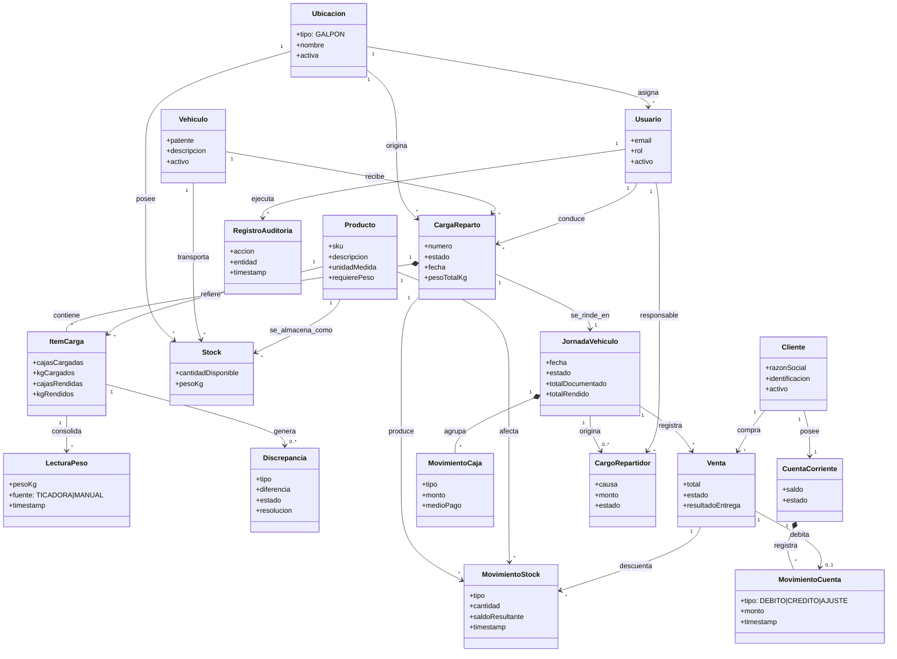

---

# 8. Requisitos funcionales

## 8.1 Módulo de Cargas, Remitos y Pesaje (RF-1xx)

| ID | Requisito | Prioridad | Supuesto |
|---|---|:--:|:--:|
| RF-100 | El sistema permitirá al Encargado de Galpón crear una carga/remito indicando galpón de origen, vehículo, repartidor, fecha y recorrido previsto. | M | — |
| RF-101 | El sistema asignará a cada remito un número correlativo único e irrepetible por origen. | M | — |
| RF-102 | El sistema permitirá agregar uno o más ítems indicando producto, cantidad de cajas y kilogramos cargados. | M | SUP-01 |
| RF-103 | El sistema asociará a cada ítem las lecturas de peso obtenidas durante el encajonado. | M | SUP-01, SUP-17 |
| RF-104 | El sistema validará que la cantidad declarada de cada ítem no exceda el stock disponible en la ubicación de origen. | M | — |
| RF-105 | El sistema mantendrá el remito en estado `BORRADOR` hasta su despacho, permitiendo su edición y eliminación durante ese estado. | M | — |
| RF-106 | El sistema permitirá despachar la carga, transicionándola a `EN_REPARTO`. | M | — |
| RF-107 | Al despachar, el sistema transferirá de forma atómica las cajas y kilogramos desde el stock del galpón al stock del vehículo asignado. | M | — |
| RF-108 | El sistema impedirá toda modificación del contenido de un remito despachado. | M | SUP-06 |
| RF-109 | El sistema exigirá asignar un vehículo y un repartidor responsable antes del despacho. | M | SUP-15 |
| RF-110 | El sistema permitirá al repartidor confirmar desde el móvil la entrega física a cada cliente. | M | — |
| RF-111 | El sistema listará al repartidor únicamente los pedidos/remitos de su recorrido activo. | M | — |
| RF-112 | El sistema permitirá registrar cada parada como `ENTREGADA`, `ENTREGADA_PARCIAL` o `NO_ENTREGADA`. | M | — |
| RF-113 | Para una entrega total o parcial, el sistema exigirá las cajas y kilogramos efectivamente entregados por producto. | M | SUP-01 |
| RF-114 | El sistema calculará automáticamente la diferencia entre lo asignado a la parada y lo entregado. | M | — |
| RF-115 | Si la entrega coincide con lo asignado, el sistema marcará el documento como `ENTREGADO_OK`. | M | — |
| RF-116 | Ante una entrega parcial o no realizada, el sistema exigirá un motivo y mantendrá la mercadería no entregada en el stock del vehículo para su devolución al galpón. | M | — |
| RF-117 | El sistema permitirá adjuntar observación y fotografía como evidencia de una entrega con novedad. | S | — |
| RF-118 | Al confirmar una entrega, el sistema descontará del stock del vehículo únicamente las cantidades efectivamente entregadas. | M | SUP-07 |
| RF-119 | El sistema permitirá la anulación autorizada de una carga en `EN_REPARTO`, con movimientos compensatorios hacia el galpón y motivo obligatorio. | S | SUP-06 |
| RF-120 | Durante la rendición, el sistema generará una discrepancia por cada producto cuya carga no quede explicada por entregas, devoluciones y merma registrada. | M | — |
| RF-121 | El sistema clasificará la discrepancia como `FALTANTE` o `SOBRANTE` según el signo de la diferencia. | M | SUP-05 |
| RF-122 | El sistema mantendrá la discrepancia en estado `ABIERTA` hasta su resolución por un rol autorizado. | M | — |
| RF-123 | El sistema permitirá resolver una discrepancia imputándola a merma operativa, error de carga, error de conteo, devolución, faltante no justificado u otra causa con descripción. | M | — |
| RF-124 | El sistema registrará el usuario, la fecha y la justificación de toda resolución de discrepancia. | M | — |
| RF-125 | El sistema notificará a la gerencia las discrepancias cuya magnitud supere la tolerancia parametrizada. | S | SUP-08 |
| RF-126 | El sistema presentará un panel de discrepancias abiertas ordenadas por antigüedad. | M | — |
| RF-127 | El sistema permitirá registrar la devolución de mercadería desde el vehículo al galpón, conservando el vínculo con la carga y la causa. | M | — |
| RF-128 | El sistema permitirá imprimir el remito/comprobante en formato A4 para respaldo físico y copia del cliente. | M | — |
| RF-129 | El sistema deberá recibir o importar de la balanza/ticadora el peso expresado en kilogramos, sin exigir su reescritura manual cuando la interfaz técnica lo permita. | M | SUP-17 |
| RF-130 | Cada lectura de peso conservará valor, fecha/hora, origen de captura, operador, producto, carga y vehículo asociados. | M | SUP-17 |
| RF-131 | El sistema impedirá que una misma lectura identificada por la ticadora se impute a más de un ítem de carga. | M | SUP-17 |
| RF-132 | El sistema permitirá validar o rechazar una lectura antes del despacho; todo rechazo exigirá motivo y quedará auditado. | M | — |
| RF-133 | Si la integración no está disponible, el sistema permitirá ingreso manual del peso con motivo obligatorio y marca de origen `MANUAL`. | M | SUP-17, RES-09 |
| RF-134 | El sistema mostrará antes del despacho los totales de cajas y kilogramos por producto y por vehículo, y exigirá confirmación del Encargado de Galpón. | M | SUP-01 |

## 8.2 Módulo de Inventario (RF-2xx)

| ID | Requisito | Prioridad | Supuesto |
|---|---|:--:|:--:|
| RF-200 | El sistema mantendrá el saldo de stock por combinación de producto y ubicación operativa (`GALPON` o `VEHICULO`). | M | — |
| RF-201 | El sistema registrará todo cambio de inventario como un movimiento inmutable, con tipo, cantidad, saldo resultante, usuario, timestamp y referencia al documento que lo origina. | M | — |
| RF-202 | El sistema no permitirá la modificación ni la eliminación de un movimiento de stock ya registrado; toda corrección se materializa como un nuevo movimiento compensatorio. | M | — |
| RF-203 | El sistema expondrá la consulta de stock disponible por vehículo y en el galpón. | M | — |
| RF-204 | El sistema expondrá la consulta de stock consolidado de toda la organización a roles gerenciales. | M | — |
| RF-205 | El sistema expondrá la mercadería en reparto discriminada por carga, vehículo, repartidor y producto. | M | — |
| RF-206 | El sistema permitirá el ajuste manual de stock con motivo obligatorio y autorización conforme a RN-40. | M | — |
| RF-207 | El sistema permitirá registrar un conteo físico de inventario, calculando automáticamente la diferencia contra el saldo teórico. | S | — |
| RF-208 | El sistema generará el movimiento de ajuste derivado del conteo físico, dejando trazabilidad del conteo original. | S | — |
| RF-209 | El sistema permitirá el registro de mermas con tipificación de causa. | M | — |
| RF-210 | El sistema alertará cuando el stock de un producto en una ubicación descienda por debajo de un umbral mínimo parametrizable. | C | — |
| RF-211 | El sistema mantendrá el catálogo de productos con alta, baja lógica y modificación. | M | — |
| RF-212 | El sistema impedirá la eliminación física de un producto con movimientos históricos asociados, admitiendo únicamente su desactivación. | M | — |
| RF-213 | El sistema gestionará el inventario de insumos con la misma mecánica de movimientos que los productos comercializables, diferenciándolos por tipo. | S | — |
| RF-214 | El sistema permitirá consultar el kardex histórico de un producto en una ubicación para un rango de fechas. | S | — |
| RF-215 | El sistema conciliará para cada carga las cajas y kilogramos cargados contra la suma de cantidades entregadas, devueltas, registradas como merma y clasificadas como faltante/sobrante. | M | — |
| RF-216 | El sistema mantendrá el saldo de cajas/cajones retornables entregados y recuperados por cliente, vehículo y recorrido. | M | — |
| RF-217 | El sistema exigirá declarar las cajas retornables al regreso y calculará automáticamente su diferencia contra las entregadas. | M | — |
| RF-218 | El sistema registrará por separado la mercadería devuelta por no entrega y la devolución por defecto de faena/calidad, con causa y evidencia opcional. | M | — |

## 8.3 Módulo Comercial (RF-3xx)

| ID | Requisito | Prioridad | Supuesto |
|---|---|:--:|:--:|
| RF-300 | El sistema permitirá al Repartidor-Cajero registrar desde el móvil una operación de venta/entrega compuesta por uno o más ítems. | M | — |
| RF-301 | El sistema exigirá una jornada abierta para el vehículo y repartidor asignados antes de registrar ventas. | M | SUP-15 |
| RF-302 | El sistema permitirá el ingreso de la cantidad vendida por unidad o por peso, según la configuración del producto. | M | SUP-01 |
| RF-303 | El sistema calculará el importe de cada ítem y el total de la operación. | M | — |
| RF-304 | El sistema descontará el stock del vehículo de forma automática y atómica al confirmar la entrega/venta. | M | SUP-07 |
| RF-305 | El sistema advertirá, sin bloquear, cuando una venta deje el stock de un producto en valor negativo, registrando el evento para revisión. | M | — |
| RF-306 | El sistema registrará exclusivamente los medios de pago `EFECTIVO`, `CHEQUE` y `TRANSFERENCIA`, o la condición `CUENTA_CORRIENTE`; rechazará débito, tarjeta de crédito y billetera virtual en el MVP. | M | SUP-12 |
| RF-307 | El sistema permitirá la anulación de una venta dentro de la misma jornada, generando la reversión del stock y del movimiento de caja. | M | — |
| RF-308 | El sistema exigirá motivo obligatorio y autorización superior para toda anulación de venta. | M | RN-40 |
| RF-309 | El sistema mantendrá una lista de precios vigente por producto. | M | — |
| RF-310 | El sistema conservará el precio histórico aplicado en cada venta, con independencia de modificaciones posteriores de la lista. | M | — |
| RF-311 | El sistema permitirá la aplicación de descuentos sujeta a autorización. | C | — |
| RF-312 | El sistema emitirá un comprobante interno no fiscal de la operación, apto para visualización móvil e impresión A4. | S | EX-01 |
| RF-313 | El sistema permitirá al Repartidor-Cajero cargar pedidos desde el celular y asociarlos al cliente y al recorrido correspondiente. | M | — |
| RF-314 | El sistema permitirá convertir un pedido en entrega/venta sin reingresar sus ítems. | M | — |
| RF-315 | Ante una no entrega, el sistema exigirá un motivo y mantendrá la mercadería en el stock del vehículo hasta su devolución o reasignación autorizada. | M | — |
| RF-316 | Para cheques y transferencias, el sistema exigirá referencia identificatoria y estado de conciliación; estos valores se mostrarán separadamente del efectivo. | M | — |

## 8.4 Módulo de Rendición y Caja por Vehículo (RF-4xx)

| ID | Requisito | Prioridad | Supuesto |
|---|---|:--:|:--:|
| RF-400 | El sistema permitirá abrir una jornada identificada por fecha, vehículo y Repartidor-Cajero, vinculada a una carga despachada. | M | SUP-15 |
| RF-401 | El sistema impedirá que un vehículo o repartidor tenga más de una jornada abierta simultáneamente. | M | — |
| RF-402 | El sistema imputará automáticamente a la jornada las ventas, entregas, cobranzas, devoluciones, mermas y movimientos del recorrido. | M | — |
| RF-403 | El sistema permitirá registrar movimientos no comerciales autorizados de la caja del vehículo, con tipo, monto, motivo y evidencia opcional. | M | — |
| RF-404 | El sistema calculará el efectivo esperado como ventas/cobranzas en efectivo más ingresos autorizados menos retiros o gastos registrados. | M | — |
| RF-405 | El sistema exigirá al regreso la declaración del efectivo, los cheques y las referencias de transferencias rendidos por el repartidor. | M | — |
| RF-406 | El sistema calculará y persistirá por separado las diferencias de efectivo, cheques y transferencias. | M | — |
| RF-407 | Toda diferencia de valores exigirá una justificación textual y quedará vinculada al repartidor responsable. | M | — |
| RF-408 | El sistema requerirá autorización de Gerencia para cerrar una jornada con faltante de caja, cargo por mercadería o cajas retornables faltantes. | M | RN-40 |
| RF-409 | El sistema impedirá registrar nuevas operaciones ordinarias sobre una jornada cerrada; toda corrección posterior será un ajuste referenciado y autorizado. | M | — |
| RF-410 | El sistema alertará a Gerencia sobre vehículos con jornadas de días anteriores sin rendir o cerrar. | M | — |
| RF-411 | El sistema desglosará el arqueo por efectivo, cheques, transferencias, débitos en cuenta corriente y movimientos no comerciales. | M | SUP-12, SUP-13 |
| RF-412 | El sistema calculará el total documentado de las boletas/ventas entregadas del vehículo y lo comparará con la suma de valores rendidos y débitos válidos en cuenta corriente. | M | — |
| RF-413 | El sistema presentará un arqueo único por vehículo con dos conciliaciones: **mercadería** (cajas y kg) y **valores** (dinero, cheques, transferencias y cuenta corriente). | M | — |
| RF-414 | El sistema calculará la merma porcentual del recorrido como `(kg cargados - kg entregados - kg devueltos) / kg cargados × 100`. | M | SUP-08 |
| RF-415 | Si la merma es de hasta 3 % inclusive, el sistema la registrará como tolerada; si excede 3 %, abrirá una discrepancia imputable para revisión. | M | SUP-08 |
| RF-416 | El sistema permitirá generar un cargo monetario al repartidor por la porción de merma que exceda la tolerancia, con importe, criterio de valuación, motivo y autorización. | M | SUP-18 |
| RF-417 | El sistema permitirá generar un cargo monetario al repartidor por faltante de efectivo o valores, sin eliminar ni alterar la diferencia original de arqueo. | M | — |
| RF-418 | El sistema permitirá generar un cargo por cajas/cajones no devueltos, con cantidad, importe y referencia al recorrido. | M | SUP-18 |
| RF-419 | El sistema solo permitirá cerrar la jornada cuando el 100 % de la carga y de las ventas entregadas esté explicado por entregas, devoluciones, merma, valores rendidos, cuenta corriente o cargos autorizados. | M | — |

## 8.5 Módulo de Reportes y Consolidación (RF-5xx)

| ID | Requisito | Prioridad |
|---|---|:--:|
| RF-500 | El sistema presentará un tablero gerencial con ventas del día por vehículo/repartidor, consolidadas y comparadas. | M |
| RF-501 | El sistema presentará el flujo de caja consolidado de la organización para un rango de fechas. | M |
| RF-502 | El sistema presentará el estado de inventario consolidado y discriminado entre galpón y vehículos. | M |
| RF-503 | El sistema presentará el listado de discrepancias abiertas y su antigüedad. | M |
| RF-504 | El sistema presentará el histórico de remitos con filtros por origen, destino, estado y rango de fechas. | M |
| RF-505 | El sistema presentará un informe de mermas por causa, producto y ubicación. | S |
| RF-506 | El sistema presentará el ranking de productos más vendidos por vehículo, cliente y período. | C |
| RF-507 | El sistema permitirá la exportación de todo reporte a formato CSV o Excel. | M |
| RF-508 | El sistema presentará la evolución temporal de ventas para análisis de estacionalidad. | C |
| RF-509 | El sistema presentará un informe de rendición por vehículo con carga, entregas, devoluciones, mermas, faltantes y cargos. | M |
| RF-510 | El sistema presentará un informe de cargos a repartidores filtrable por causa, estado, responsable y período. | M |
| RF-511 | El sistema presentará un informe de saldos y antigüedad de cuentas corrientes por cliente. | M |

## 8.6 Módulo de Administración y Auditoría (RF-6xx)

| ID | Requisito | Prioridad |
|---|---|:--:|
| RF-600 | El sistema registrará en bitácora inmutable toda operación que cree, modifique o anule información relevante del dominio. | M |
| RF-601 | Cada registro de bitácora contendrá usuario, rol, acción, entidad afectada, identificador, valores previos y posteriores, timestamp y dirección IP de origen. | M |
| RF-602 | El sistema permitirá la consulta filtrada de la bitácora a roles autorizados. | M |
| RF-603 | El sistema no permitirá la eliminación ni la alteración de registros de bitácora por ningún rol, incluido el administrador. | M |
| RF-604 | El sistema conservará la bitácora por un período mínimo de veinticuatro meses. | S |
| RF-605 | El sistema gestionará el alta, baja lógica y modificación de usuarios, con asignación de rol y ubicación. | M |
| RF-606 | El sistema gestionará el alta, baja lógica y modificación del galpón y de los vehículos/puntos de venta móviles. | M |
| RF-607 | El sistema expondrá los parámetros configurables del negocio (tolerancia de merma, motivos, valuaciones y umbrales) en una interfaz de administración. | S |

## 8.7 Módulo de Cuentas Corrientes (RF-7xx)

| ID | Requisito | Prioridad | Supuesto |
|---|---|:--:|:--:|
| RF-700 | El sistema gestionará el alta, baja lógica y modificación de clientes, con los datos identificatorios y de contacto mínimos necesarios. | M | SUP-13 |
| RF-701 | El sistema permitirá habilitar una cuenta corriente única por cliente mayorista. | M | SUP-13 |
| RF-702 | Al confirmar una venta bajo condición `CUENTA_CORRIENTE`, el sistema generará automáticamente un movimiento de débito por el total adeudado y conservará el vínculo con la venta, vehículo y repartidor. | M | SUP-13 |
| RF-703 | El sistema permitirá registrar cobranzas de cuenta corriente mediante efectivo, cheque o transferencia, generando un movimiento de crédito. | M | SUP-12, SUP-13 |
| RF-704 | El sistema exigirá seleccionar explícitamente las ventas/documentos cancelados por cada cobranza; no aplicará imputación automática sin criterio confirmado. | M | — |
| RF-705 | El sistema calculará el saldo del cliente como suma inmutable de débitos, créditos y ajustes autorizados. | M | — |
| RF-706 | El sistema permitirá consultar y exportar un extracto cronológico con saldo anterior, movimientos y saldo resultante. | M | — |
| RF-707 | Todo ajuste manual de cuenta corriente exigirá motivo y autorización de Gerencia, sin modificar movimientos históricos. | M | RN-40 |
| RF-708 | El sistema impedirá eliminar un cliente con movimientos históricos; solo permitirá su baja lógica. | M | — |

---

# 9. Reglas de negocio

Las reglas de negocio constituyen restricciones del dominio que el sistema debe hacer cumplir con independencia de la interfaz desde la cual se opere. Su implementación reside en la capa de servicio del backend, nunca exclusivamente en el cliente.

## 9.1 Reglas de integridad de inventario

| ID | Regla |
|---|---|
| **RN-01** | El inventario es un **libro mayor de solo agregación**. Todo saldo es la resultante de la suma de sus movimientos; ningún proceso puede alterar un saldo sin generar el movimiento correspondiente. |
| **RN-02** | Ningún movimiento de stock puede existir sin un documento que lo origine: carga/remito, entrega/venta, devolución, ajuste, conteo o merma. |
| **RN-03** | Al despachar, la mercadería abandona el stock del galpón e ingresa al stock del vehículo asignado, donde permanece bajo responsabilidad del repartidor hasta su entrega o devolución. |
| **RN-04** | La suma del stock del galpón más el stock de todos los vehículos debe ser consistente con el histórico de movimientos en todo momento (invariante de conservación). |
| **RN-05** | El stock negativo constituye una **anomalía tolerada pero registrada**: la operación comercial no se bloquea, pero el evento se persiste y se reporta a gerencia. Se prioriza la continuidad de la atención al público sobre la rigidez del control. |
| **RN-06** | Un producto con movimientos históricos no puede eliminarse; únicamente puede desactivarse. La integridad referencial del histórico es inviolable. |

## 9.2 Reglas del ciclo de carga, reparto y merma

| ID | Regla |
|---|---|
| **RN-10** | Un remito solo es editable en estado `BORRADOR`. |
| **RN-11** | El despacho de una carga es transaccional: o se transfieren al vehículo todos los ítems, cajas y kilogramos, o no se transfiere ninguno. |
| **RN-12** | La cantidad entregada y la devuelta deben declararse explícitamente. El sistema no asume que equivalen a la cantidad cargada. |
| **RN-13** | Toda diferencia entre carga y rendición —positiva o negativa— genera una discrepancia de registro obligatorio. |
| **RN-14** | Una discrepancia imputable o un cargo no puede ser autorizado exclusivamente por el repartidor afectado; requiere Encargado de Galpón y, cuando implique cargo, autorización de Gerencia (**segregación de funciones**). |
| **RN-15** | Toda resolución de discrepancia debe imputarse a una causa tipificada; no se admite el cierre sin clasificación. |
| **RN-16** | La tolerancia inicial de merma es **3 % inclusive** del peso cargado por recorrido. Se calcula como `(kg cargados - kg entregados - kg devueltos) / kg cargados × 100`. Si los kg cargados son cero, la fórmula no se evalúa y el cierre requiere revisión. |
| **RN-17** | Un remito anulado revierte íntegramente sus movimientos de stock mediante movimientos compensatorios; los movimientos originales se conservan. |
| **RN-18** | La numeración de remitos es correlativa, sin huecos y sin reutilización, con origen sistémico en el galpón. |
| **RN-19** | Toda lectura de la ticadora y todo ingreso manual de peso se conserva como registro auditable. Una corrección genera una nueva lectura/ajuste y no sobrescribe la original. |
| **RN-20** | Todo repartidor debe rendir el **100 % de la carga**: por cada producto, `cargado = entregado + devuelto + merma + faltante/sobrante resuelto`, medido en cajas y kilogramos según corresponda. |
| **RN-21** | La tolerancia de merma no elimina la obligación de rendición ni el registro. Solo determina si la merma es tolerada o si requiere revisión y posible cargo. |
| **RN-22** | La porción de merma que exceda el 3 % se clasifica como diferencia imputable hasta que el Encargado de Galpón o Gerencia determine otra causa documentada. |
| **RN-23** | Todo cargo por mercadería debe conservar el cálculo físico que lo originó, el importe, el criterio de valuación, la autorización y el repartidor responsable. |
| **RN-24** | Las cajas/cajones retornables se concilian por cantidad. Toda unidad no devuelta debe justificarse o generar un cargo autorizado. |
| **RN-25** | La mercadería no entregada al cliente debe regresar bajo responsabilidad del repartidor y reincorporarse al galpón mediante un movimiento de devolución; no puede desaparecer del circuito por anulación de la boleta. |

## 9.3 Reglas comerciales y de caja

| ID | Regla |
|---|---|
| **RN-30** | Ninguna operación comercial puede registrarse sin una jornada abierta para el vehículo y Repartidor-Cajero correspondientes. |
| **RN-31** | Un vehículo y un repartidor no pueden participar en más de una jornada abierta simultáneamente. |
| **RN-32** | Una jornada cerrada es inmutable. Las correcciones posteriores se materializan como movimientos de ajuste en una jornada nueva, con referencia a la jornada corregida. |
| **RN-33** | El precio aplicado en una venta se congela en el momento de la operación y es independiente de modificaciones posteriores de la lista de precios. |
| **RN-34** | La anulación de una venta genera la reversión simétrica de sus efectos sobre stock y caja; nunca la eliminación del registro original. |
| **RN-35** | Los únicos medios de pago del MVP son **efectivo, cheque y transferencia**. La cuenta corriente es una condición de venta y no un ingreso de caja. No se admiten tarjetas ni billeteras virtuales. |
| **RN-36** | Toda diferencia de arqueo exige justificación. Un faltante de caja genera un cargo al repartidor y exige autorización de Gerencia; el registro original de la diferencia permanece inmutable. |
| **RN-37** | La cuenta corriente es un libro mayor de solo agregación: las ventas generan débitos; las cobranzas, créditos; y las correcciones, ajustes referenciados y autorizados. |
| **RN-38** | Una venta a cuenta corriente solo queda conciliada si el débito se vincula a un cliente identificado y a la venta/remito que lo originó. |
| **RN-39** | La rendición financiera del vehículo debe explicar el 100 % de las ventas entregadas mediante efectivo, cheques, transferencias verificables y débitos válidos en cuenta corriente. |

## 9.4 Reglas transversales de control

| ID | Regla |
|---|---|
| **RN-40** | Requieren autorización de Gerencia: ajuste manual de stock, anulación de venta, anulación de carga despachada, cierre con faltante, cargo a repartidor, ajuste manual de cuenta corriente y descuento comercial no previsto. |
| **RN-41** | Todo usuario opera bajo credenciales individuales e intransferibles. La trazabilidad de responsabilidad es un requisito no negociable del sistema. |
| **RN-42** | Un Repartidor-Cajero solo accede a los datos del vehículo y recorrido asignados, salvo permiso global explícito. |
| **RN-43** | Ninguna acción con efecto sobre el dominio puede ejecutarse de forma anónima. |
| **RN-44** | La bitácora de auditoría es de escritura exclusiva. Ningún rol del sistema, incluido el de máximo privilegio, dispone de operaciones de modificación o borrado sobre ella. |
| **RN-45** | Un cargo al repartidor es una obligación interna registrada y autorizada; el MVP no efectúa liquidación automática de haberes ni modifica retrospectivamente caja, venta o inventario. |
| **RN-46** | Las operaciones realizadas bajo contingencia manual deben cargarse posteriormente con referencia al documento en papel y clave de idempotencia; la carga diferida no puede duplicar ventas, cobros ni movimientos de stock. |

---

# 10. Requisitos no funcionales

Clasificados conforme a las características de calidad de la norma **ISO/IEC 25010**.

## 10.1 Rendimiento y eficiencia

| ID | Requisito | Criterio de verificación |
|---|---|---|
| RNF-01 | El tiempo de respuesta de las operaciones de consulta habituales no superará **1,5 segundos** en el percentil 95, bajo condiciones normales de conectividad. | Medición con herramientas de *profiling* sobre entorno de pruebas |
| RNF-02 | La confirmación móvil de una entrega/venta se completará en menos de **1 segundo** en el percentil 95 bajo conectividad normal. | Prueba de carga sobre el endpoint de entregas/ventas |
| RNF-03 | El sistema soportará **al menos 30 usuarios concurrentes** sin degradación perceptible del tiempo de respuesta. | Prueba de carga con JMeter o k6 |
| RNF-04 | Las consultas de reportes consolidados sobre un rango de hasta doce meses se resolverán en menos de **5 segundos**. | Prueba con volumen de datos sintéticos representativo |
| RNF-05 | El peso inicial del *bundle* de la aplicación cliente no excederá **500 KB** comprimidos, en atención al uso sobre redes móviles. | Análisis del build de producción |

## 10.2 Fiabilidad y disponibilidad

| ID | Requisito |
|---|---|
| RNF-10 | El objetivo de disponibilidad del servicio durante la ventana operativa (04:30 a 22:00) es del **99 %** mensual, dado que el despacho comienza aproximadamente a las 05:00. Este valor depende de RES-02 y SUP-16. |
| RNF-11 | **RPO (Recovery Point Objective): 24 horas.** Se admite la pérdida de hasta un día de información ante desastre, cubierta por respaldo diario automatizado. |
| RNF-12 | **RTO (Recovery Time Objective): 4 horas.** Tiempo máximo para restablecer el servicio a partir de un respaldo. |
| RNF-13 | Toda operación que afecte inventario o caja se ejecutará dentro de una **transacción ACID**; no se admiten estados intermedios persistidos. |
| RNF-14 | El sistema implementará **idempotencia** en las operaciones de escritura críticas mediante clave de idempotencia, a fin de neutralizar el reenvío por reintento del cliente ante conectividad inestable. |
| RNF-15 | Ante pérdida de conectividad durante una operación, el cliente presentará un estado de error inequívoco y ofrecerá reintento seguro, sin producir duplicación de registros. |
| RNF-16 | Se ejecutará un respaldo automático diario de la base de datos, con retención mínima de **siete días** y verificación periódica de restauración. |
| RNF-17 | Se documentará y comunicará al galpón y a los repartidores un **procedimiento de contingencia manual** (papel/cuaderno y carga diferida) aplicable ante indisponibilidad del sistema o de la red móvil. |
| RNF-18 | La carga diferida de operaciones de contingencia deberá conservar el identificador del documento físico y aplicar idempotencia para evitar duplicados. |

## 10.3 Seguridad

| ID | Requisito |
|---|---|
| RNF-20 | La totalidad de las comunicaciones se cifrará mediante **TLS 1.2 o superior**. |
| RNF-21 | Las contraseñas se almacenarán exclusivamente mediante función de derivación de clave con costo computacional (**BCrypt**, factor ≥ 10). |
| RNF-22 | La autenticación se resolverá mediante **JWT** con expiración del token de acceso no superior a 60 minutos y mecanismo de renovación. |
| RNF-23 | Toda petición a la API será autorizada en el servidor conforme al rol y al ámbito operativo (vehículo, recorrido o alcance global) del usuario. La ocultación de elementos en la interfaz no constituye control de acceso. |
| RNF-24 | El sistema se protegerá contra las categorías de riesgo del **OWASP Top 10**, con atención específica a inyección SQL (uso de sentencias parametrizadas y ORM), *broken access control* y exposición de datos sensibles. |
| RNF-25 | Se implementará **limitación de tasa** (*rate limiting*) sobre los endpoints de autenticación para mitigar ataques de fuerza bruta. |
| RNF-26 | El tratamiento de datos personales se ajustará a la **Ley N.º 25.326**, limitando la recolección a los datos estrictamente necesarios para la finalidad declarada. |
| RNF-27 | Las credenciales y secretos de configuración se gestionarán mediante **variables de entorno**, quedando expresamente prohibida su inclusión en el repositorio de código. |
| RNF-28 | Se registrarán los intentos fallidos de autenticación y los accesos denegados por autorización. |

## 10.4 Usabilidad

| ID | Requisito |
|---|---|
| RNF-30 | La interfaz será **responsiva**, plenamente operable en resoluciones desde 360 px de ancho. |
| RNF-31 | Las operaciones de alta frecuencia (captura de pedido, confirmación de entrega y registro de cobro) se completarán en un máximo de **tres interacciones significativas**. |
| RNF-32 | Los elementos interactivos en vistas de uso móvil tendrán un área táctil mínima de **44 × 44 px**. |
| RNF-33 | El sistema proveerá retroalimentación visual explícita del resultado de toda operación con efecto persistente. |
| RNF-34 | Los mensajes de error se expresarán en lenguaje natural orientado a la acción correctiva, sin exposición de detalles técnicos internos. |
| RNF-35 | Un usuario operativo sin formación técnica previa deberá alcanzar autonomía en las tareas de su rol tras una capacitación no superior a **una hora**. |
| RNF-36 | La aplicación estará íntegramente en idioma español rioplatense, con la terminología propia del negocio. |

## 10.5 Mantenibilidad y portabilidad

| ID | Requisito |
|---|---|
| RNF-40 | El código fuente residirá en un repositorio con control de versiones **Git**, bajo un flujo de ramas documentado. |
| RNF-41 | La totalidad de los entornos (desarrollo, pruebas, producción) se definirá mediante **Docker**, garantizando paridad entre ellos. |
| RNF-42 | La cobertura de pruebas automatizadas de la capa de lógica de negocio no será inferior al **70 %**. |
| RNF-43 | La API expondrá documentación autogenerada conforme a **OpenAPI 3.0**. |
| RNF-44 | El sistema respetará una **separación estricta en capas** (presentación, aplicación, dominio, infraestructura), sin dependencias invertidas hacia la infraestructura desde el dominio. |
| RNF-45 | El esquema de base de datos evolucionará mediante **migraciones versionadas** (Flyway o Liquibase); no se admiten modificaciones manuales del esquema en producción. |
| RNF-46 | El sistema no dependerá de características propietarias de un proveedor de nube específico, garantizando su portabilidad. |
| RNF-47 | Se aplicará un estándar de estilo de código verificado automáticamente en el pipeline de integración. |
| RNF-48 | Toda decisión arquitectónica significativa se documentará mediante un **ADR**. |
| RNF-49 | El sistema emitirá logs estructurados con nivel de severidad, aptos para su agregación y consulta. |

## 10.6 Compatibilidad

| ID | Requisito |
|---|---|
| RNF-50 | La aplicación será compatible con las dos últimas versiones estables de Chrome, Firefox, Edge y Safari. |
| RNF-51 | El sistema soportará la impresión A4 de remitos/comprobantes y la emisión de etiquetas de peso mediante la ticadora, sin requerir una impresora térmica de punto de venta. |
| RNF-52 | La integración de la ticadora se encapsulará detrás de un adaptador sustituible, para que marca, puerto o formato de datos no contaminen las reglas de negocio. |

---

# 11. Casos de uso y flujos de proceso

## 11.1 Diagrama general de casos de uso

```mermaid
flowchart TB
    EG(("👤 Encargado<br/>de Galpón"))
    RP(("👤 Repartidor-<br/>Cajero"))
    AD(("👤 Administración<br/>/ Cobranzas"))
    GE(("👤 Gerencia"))
    TK(("⚖️ Ticadora"))

    subgraph SYS["Sistema Pollito Casero"]
        CU1["CU-01<br/>Pesar y armar carga"]
        CU2["CU-02<br/>Despachar vehículo"]
        CU3["CU-03<br/>Confirmar entrega/no entrega"]
        CU4["CU-04<br/>Rendir carga del recorrido"]
        CU5["CU-05<br/>Resolver discrepancia"]
        CU6["CU-06<br/>Registrar venta"]
        CU7["CU-07<br/>Abrir jornada vehicular"]
        CU8["CU-08<br/>Cerrar arqueo por vehículo"]
        CU9["CU-09<br/>Ajustar stock"]
        CU10["CU-10<br/>Consultar consolidado"]
        CU11["CU-11<br/>Registrar merma/cargo"]
        CU12["CU-12<br/>Auditar operaciones"]
        CU13["CU-13<br/>Vender a cuenta corriente"]
        CU14["CU-14<br/>Registrar cobranza"]
    end

    EG --> CU1
    EG --> CU2
    EG --> CU9
    EG --> CU11
    TK --> CU1
    RP --> CU3
    RP --> CU4
    RP --> CU6
    RP --> CU7
    RP --> CU8
    RP --> CU13
    EG --> CU4
    EG --> CU7
    EG --> CU8
    AD --> CU13
    AD --> CU14
    GE --> CU5
    GE --> CU10
    GE --> CU12
    GE --> CU9
    GE --> CU11
```

## 11.2 Especificación de casos de uso críticos

### CU-04 — Rendir carga del recorrido

| Campo | Contenido |
|---|---|
| **Identificador** | CU-04 |
| **Actor principal** | Encargado de Galpón / Reparto |
| **Actores secundarios** | Repartidor-Cajero; Gerencia (si existe diferencia imputable) |
| **Objetivo** | Explicar el 100 % de las cajas y kilogramos cargados mediante entregas, devoluciones, merma y diferencias resueltas |
| **Precondiciones** | Existe una carga en estado `EN_REPARTO`; el vehículo regresó al galpón; sus entregas/no entregas fueron registradas o se dispone de documentación de contingencia. |
| **Postcondiciones (éxito)** | La carga queda `RENDIDA`; la mercadería devuelta ingresa al galpón; las mermas y discrepancias quedan registradas; todo cargo queda pendiente o autorizado; la operación queda en bitácora. |
| **Requisitos asociados** | RF-120 a RF-127, RF-215 a RF-218, RF-414 a RF-419 |
| **Reglas aplicables** | RN-03, RN-12 a RN-16, RN-20 a RN-25 |

**Flujo principal**

1. El Encargado selecciona la jornada y carga del vehículo regresado.
2. El sistema presenta por producto las cajas y kg cargados, entregados y pendientes de explicar.
3. El Repartidor-Cajero declara la mercadería devuelta y las cajas retornables recuperadas.
4. El Encargado valida el conteo y el peso de regreso.
5. El sistema calcula por producto la merma y la diferencia residual.
6. El sistema clasifica como tolerada la merma de hasta 3 % inclusive.
7. El usuario asigna causa a toda diferencia restante y adjunta observación/evidencia cuando corresponda.
8. El sistema verifica la ecuación de rendición del 100 % en cajas y kg.
9. El sistema registra, en una única transacción, devoluciones al galpón, mermas, discrepancias, posibles cargos y bitácora.
10. El sistema informa el resultado y habilita el arqueo financiero del vehículo.

**Flujo alternativo A — Merma superior a 3 % o faltante de cajas**

- 6a. El sistema abre una discrepancia imputable y exige causa y justificación.
- 6b. El Encargado registra el importe propuesto y el criterio de valuación del cargo.
- 6c. Gerencia autoriza, modifica o rechaza el cargo.
- 6d. La carga no queda `RENDIDA` hasta que la diferencia esté explicada mediante una resolución o cargo autorizado.

**Flujo de excepción E1 — Operaciones registradas en contingencia manual**

- 1a. El usuario selecciona «carga diferida» e identifica cada boleta física.
- 1b. El sistema valida que el identificador no haya sido cargado previamente.
- 1c. El flujo continúa con los datos reconstruidos; la bitácora marca su origen `CONTINGENCIA`.

**Flujo de excepción E2 — Peso cargado igual a cero**

- 5a. El sistema no calcula porcentaje de merma y bloquea el cierre hasta que el Encargado corrija o justifique el dato de carga.

### CU-08 — Cerrar arqueo por vehículo

| Campo | Contenido |
|---|---|
| **Identificador** | CU-08 |
| **Actor principal** | Encargado de Galpón / Reparto |
| **Actores secundarios** | Repartidor-Cajero; Gerencia |
| **Objetivo** | Conciliar por vehículo el total de ventas entregadas contra efectivo, cheques, transferencias y débitos en cuenta corriente |
| **Precondiciones** | Existe una jornada abierta para el vehículo; la carga física fue rendida; todas las entregas y no entregas están registradas. |
| **Postcondiciones** | La jornada queda `CERRADA` e inmutable, o `PENDIENTE_AUTORIZACION` si existe un cargo. Las diferencias permanecen disponibles para consolidación gerencial. |
| **Requisitos asociados** | RF-400 a RF-419, RF-702 a RF-704 |
| **Reglas aplicables** | RN-30 a RN-40, RN-45 |

**Flujo principal**

1. El usuario solicita el arqueo de la jornada del vehículo.
2. El sistema calcula el total documentado de las ventas efectivamente entregadas.
3. El sistema presenta el desglose esperado: efectivo, cheques, transferencias y cuenta corriente.
4. El Repartidor-Cajero declara los valores rendidos y el Encargado verifica sus referencias.
5. El sistema calcula diferencias por cada categoría y valida que la suma explique el 100 % de las ventas entregadas.
6. Si no existen diferencias, el Encargado confirma el cierre.
7. El sistema registra el cierre en bitácora y publica el resultado por vehículo y consolidado.

**Flujo alternativo A — Faltante de caja o valores**

- 5a. El sistema exige justificación textual obligatoria.
- 5b. El sistema propone un cargo por el importe faltante y marca el cierre como `PENDIENTE_AUTORIZACION`.
- 5c. Gerencia autoriza, modifica o rechaza el cargo; si lo rechaza, la jornada permanece abierta para revisión.
- 5d. Una vez autorizado, el cargo explica la diferencia sin modificar la venta ni el arqueo original y la jornada puede cerrarse.

## 11.3 Diagrama de secuencia — Carga, entrega y rendición

```mermaid
sequenceDiagram
    autonumber
    actor EG as Encargado Galpón
    participant TK as Ticadora
    participant FE as Frontend React
    participant API as API Spring Boot
    participant SVC as Servicio de Dominio
    participant DB as PostgreSQL
    actor RP as Repartidor-Cajero

    EG->>FE: Crear carga para vehículo y repartidor
    FE->>API: POST /api/cargas
    API->>SVC: crearCarga(dto)
    SVC->>DB: INSERT carga (BORRADOR)
    DB-->>SVC: OK
    TK-->>FE: Lectura de peso + identificador
    FE->>API: POST /api/cargas/{id}/pesajes
    API->>SVC: asociarLectura(carga, producto, peso)
    SVC->>DB: INSERT lectura_peso + item_carga
    API-->>FE: 201 Created
    
    EG->>FE: Despachar vehículo
    FE->>API: POST /api/cargas/{id}/despachar
    API->>SVC: despachar(id)
    
    rect rgb(230, 245, 230)
    note over SVC,DB: Transacción atómica
    SVC->>DB: Validar stock disponible en galpón
    SVC->>DB: INSERT egreso GALPON + ingreso VEHICULO
    SVC->>DB: UPDATE carga → EN_REPARTO
    SVC->>DB: INSERT bitácora
    end
    
    DB-->>SVC: Commit
    SVC-->>API: OK
    API-->>FE: 200 OK

    RP->>FE: Confirmar entrega y condición de pago
    FE->>API: POST /api/entregas
    API->>SVC: confirmarEntrega(dto)
    
    rect rgb(230, 245, 230)
    note over SVC,DB: Transacción atómica
    SVC->>DB: INSERT venta + items
    SVC->>DB: INSERT egreso stock VEHICULO
    alt Cuenta corriente
        SVC->>DB: INSERT movimiento_cuenta (DEBITO)
    else Cobro
        SVC->>DB: INSERT pago (EFECTIVO|CHEQUE|TRANSFERENCIA)
    end
    SVC->>DB: INSERT bitácora
    end
    
    DB-->>SVC: Commit
    SVC-->>API: ResultadoEntrega
    API-->>FE: 200 OK
    FE-->>RP: Confirmación y saldo del recorrido

    EG->>FE: Rendir carga y valores del vehículo
    FE->>API: POST /api/jornadas/{id}/rendir
    API->>SVC: conciliarCargaYCaja(dto)
    SVC->>SVC: Validar 100 % carga + 100 % ventas
    alt Sin diferencias
        SVC->>DB: UPDATE carga → RENDIDA; jornada → CERRADA
    else Merma excedida o faltante
        SVC->>DB: INSERT discrepancia + cargo pendiente
        SVC->>DB: UPDATE jornada → PENDIENTE_AUTORIZACION
    end
    SVC->>DB: INSERT bitácora
    API-->>FE: Resultado de rendición
```

---

# 12. Arquitectura del sistema

## 12.1 Estilo arquitectónico adoptado

Se adopta un **monolito modular desplegado en contenedor**, estructurado internamente según **arquitectura por capas con orientación al dominio**.

Esta decisión —documentada formalmente en ADR-01— responde a un análisis de contexto: el volumen transaccional previsto, el tamaño del equipo y la restricción presupuestaria hacen que la adopción anticipada de microservicios introduciría complejidad operativa (orquestación, consistencia distribuida, observabilidad distribuida) sin contrapartida de valor. La modularización interna estricta preserva, no obstante, la posibilidad de extraer módulos a servicios independientes si el crecimiento lo justificara.

## 12.2 Nivel 1 — Diagrama de contexto (C4)

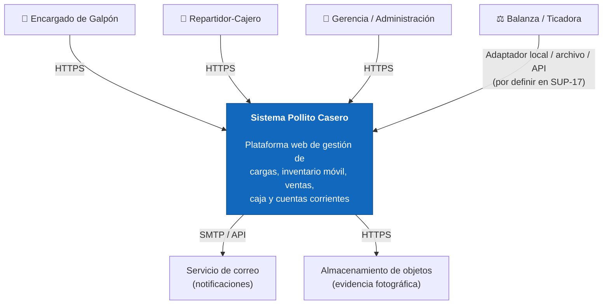

## 12.3 Nivel 2 — Diagrama de contenedores (C4)

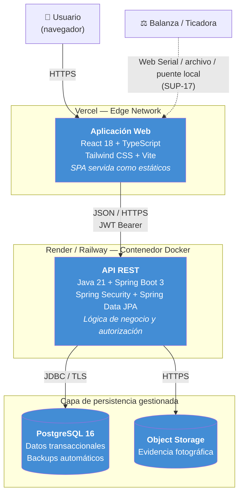

## 12.4 Nivel 3 — Componentes del backend

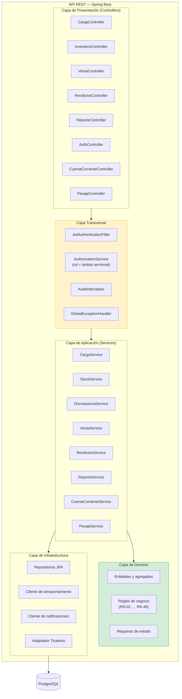

**Principio rector:** la capa de dominio no conoce a la infraestructura. Las reglas de negocio son verificables mediante pruebas unitarias sin necesidad de base de datos, servidor web ni contenedor.

## 12.5 Registro de decisiones arquitectónicas (ADR)

### ADR-01 — Monolito modular en lugar de microservicios

| Campo | Contenido |
|---|---|
| **Estado** | Aceptada |
| **Contexto** | El documento preliminar contemplaba ambas alternativas. El sistema tendrá inicialmente decenas de usuarios y volumen transaccional moderado; el equipo es reducido y el presupuesto de infraestructura es acotado. |
| **Decisión** | Implementar un monolito modular con separación estricta de módulos y capas, desplegado como contenedor único. |
| **Consecuencias positivas** | Transaccionalidad ACID trivial entre módulos (crítica para stock y caja); despliegue y observabilidad simples; menor costo de infraestructura; mayor velocidad de desarrollo. |
| **Consecuencias negativas** | Escalamiento únicamente vertical u horizontal por réplica completa; acoplamiento de despliegue entre módulos. |
| **Alternativa descartada** | Microservicios: la consistencia distribuida entre el servicio de inventario y el de ventas exigiría patrones de saga y compensación, introduciendo un riesgo desproporcionado para el problema a resolver. |

### ADR-02 — PostgreSQL como motor de persistencia

| Campo | Contenido |
|---|---|
| **Estado** | Aceptada |
| **Contexto** | El dominio es intensamente transaccional y relacional: movimientos de stock, remitos con ítems, cierres de caja. La integridad referencial y las garantías ACID son requisitos del negocio, no preferencias técnicas. |
| **Decisión** | PostgreSQL 16 como único motor de persistencia. |
| **Consecuencias** | Garantía de consistencia; soporte de transacciones complejas; ecosistema maduro; disponibilidad en capa gratuita de múltiples proveedores. |

### ADR-03 — Inventario como libro mayor de solo agregación

| Campo | Contenido |
|---|---|
| **Estado** | Aceptada |
| **Contexto** | El problema central del negocio es la **imposibilidad de reconstruir qué ocurrió con la mercadería**. Un modelo que solo persistiera saldos actuales reproduciría digitalmente esa opacidad. |
| **Decisión** | Modelar el inventario como una secuencia inmutable de movimientos; el saldo es una proyección derivada, materializada en una tabla de saldos por razones de rendimiento y actualizada dentro de la misma transacción. |
| **Consecuencias positivas** | Trazabilidad total; auditabilidad; capacidad de reconstruir el inventario a cualquier fecha; base natural para analítica. |
| **Consecuencias negativas** | Mayor volumen de datos; necesidad de mantener la coherencia entre movimientos y saldo materializado, garantizada por transaccionalidad. |

### ADR-04 — Vehículo como ubicación de stock y punto de venta

| Campo | Contenido |
|---|---|
| **Estado** | Aceptada |
| **Contexto** | El relevamiento confirmó que no existen sucursales: cada camioneta transporta stock, realiza ventas y posee una caja a cargo del repartidor. |
| **Decisión** | Modelar cada vehículo como ubicación de stock y ámbito comercial/financiero. La carga transfiere mercadería del galpón al vehículo y la rendición cierra su ciclo. |
| **Consecuencias** | La responsabilidad queda atribuida por vehículo y repartidor; el invariante de conservación (RN-04) y la rendición del 100 % (RN-20) son verificables. |

### ADR-05 — Aplicación web responsiva sin modo offline pleno en el MVP

| Campo | Contenido |
|---|---|
| **Estado** | Aceptada y actualizada tras resolver SUP-09 |
| **Contexto** | La granja no dispone de internet; el galpón sí. Los repartidores usarán celulares y una caída de media hora es crítica, por lo que el cliente prevé un plan B manual y carga posterior. |
| **Decisión** | Iniciar toda operación en línea en el galpón. Construir una aplicación web responsiva con idempotencia, retención local del formulario, reintento seguro y detección de conexión. La granja queda fuera del circuito transaccional y no se implementa sincronización offline plena en el MVP. |
| **Consecuencias** | Se evita una arquitectura offline-first para inventario, pero la continuidad de los recorridos depende del procedimiento manual y la posterior carga idempotente. |
| **Plan de contingencia** | Papel/cuaderno con identificador único, conservación de boletas y carga diferida en el galpón conforme a RN-46, RNF-17 y RNF-18. |

### ADR-06 — Autenticación mediante JWT sin estado

| Campo | Contenido |
|---|---|
| **Estado** | Aceptada |
| **Contexto** | El frontend se despliega en un dominio distinto del backend; se requiere escalabilidad horizontal sin sesión compartida. |
| **Decisión** | JWT firmado, con token de acceso de vida breve y token de renovación. Autorización evaluada en el servidor por rol y ámbito territorial en cada petición. |
| **Consecuencias** | Backend sin estado, replicable; se asume la necesidad de gestionar la revocación mediante vida breve del token. |

### ADR-07 — Integración de ticadora mediante puerto adaptador

| Campo | Contenido |
|---|---|
| **Estado** | Propuesta, condicionada por SUP-17 |
| **Contexto** | La ticadora entrega e imprime los kilos del conjunto pesado, pero todavía no se conoce marca, protocolo ni formato. Acoplar el dominio a un dispositivo específico bloquearía el desarrollo y la sustitución del hardware. |
| **Decisión** | Definir un puerto `WeightReadingProvider` en la capa de aplicación y uno o más adaptadores de infraestructura (archivo, puerto serie/USB o API). Mantener captura manual auditada como contingencia. |
| **Consecuencias** | Las reglas de carga consumen lecturas normalizadas; la prueba técnica del dispositivo puede realizarse sin modificar el modelo de dominio. |

### ADR-08 — Cuentas corrientes como libro mayor separado de caja

| Campo | Contenido |
|---|---|
| **Estado** | Aceptada |
| **Contexto** | La mayoría de los clientes mayoristas compra a cuenta corriente. Una venta financiada explica la rendición del repartidor, pero no constituye ingreso de efectivo. |
| **Decisión** | Modelar la cuenta corriente como secuencia inmutable de débitos, créditos y ajustes, separada de los movimientos de caja y vinculada a ventas/cobranzas. |
| **Consecuencias** | Se evitan saldos mutables sin historia y se puede conciliar el total documentado del vehículo sin inflar el efectivo esperado. |

---

# 13. Modelo de datos

## 13.1 Diagrama entidad-relación

```mermaid
erDiagram
    UBICACION ||--o{ USUARIO : "tiene asignados"
    UBICACION ||--o{ STOCK : "posee"
    UBICACION ||--o{ CARGA_REPARTO : "origina en galpon"
    UBICACION ||--o| VEHICULO : "representa punto movil"
    UBICACION ||--o{ MOVIMIENTO_STOCK : "registra"

    ROL ||--o{ USUARIO : "clasifica"
    USUARIO ||--o{ CARGA_REPARTO : "despacha o conduce"
    USUARIO ||--o{ VENTA : "registra"
    USUARIO ||--o{ CARGO_REPARTIDOR : "responsable"
    USUARIO ||--o{ AUDITORIA : "genera"

    CATEGORIA ||--o{ PRODUCTO : "agrupa"
    PRODUCTO ||--o{ STOCK : "se almacena como"
    PRODUCTO ||--o{ ITEM_CARGA : "se carga en"
    PRODUCTO ||--o{ ITEM_VENTA : "se vende en"
    PRODUCTO ||--o{ MOVIMIENTO_STOCK : "afecta"
    PRODUCTO ||--o{ PRECIO : "tiene histórico de"

    VEHICULO ||--o{ CARGA_REPARTO : "recibe"
    CARGA_REPARTO ||--|{ ITEM_CARGA : "contiene"
    CARGA_REPARTO ||--o{ MOVIMIENTO_STOCK : "origina"
    CARGA_REPARTO ||--|| JORNADA_VEHICULO : "se rinde en"
    ITEM_CARGA ||--o{ LECTURA_PESO : "consolida"
    ITEM_CARGA ||--o{ DISCREPANCIA : "puede generar"

    JORNADA_VEHICULO ||--o{ VENTA : "agrupa"
    JORNADA_VEHICULO ||--o{ MOVIMIENTO_CAJA : "agrupa"
    JORNADA_VEHICULO ||--o{ CARGO_REPARTIDOR : "origina"
    JORNADA_VEHICULO ||--o{ MOVIMIENTO_ENVASE : "controla"
    CLIENTE ||--o{ VENTA : "compra"
    CLIENTE ||--o{ MOVIMIENTO_ENVASE : "recibe o devuelve"
    VEHICULO ||--o{ MOVIMIENTO_ENVASE : "transporta"
    CLIENTE ||--|| CUENTA_CORRIENTE : "posee"
    CUENTA_CORRIENTE ||--o{ MOVIMIENTO_CUENTA : "registra"
    VENTA ||--|{ ITEM_VENTA : "detalla"
    VENTA ||--o{ PAGO : "puede cobrarse con"
    VENTA ||--o{ MOVIMIENTO_STOCK : "origina"
    MEDIO_PAGO ||--o{ PAGO : "clasifica"
    VENTA ||--o| MOVIMIENTO_CUENTA : "puede debitar"

    UBICACION {
        bigint id PK
        varchar nombre
        varchar tipo "GALPON|VEHICULO"
        varchar direccion
        boolean activa
        timestamp created_at
    }

    VEHICULO {
        bigint id PK
        bigint ubicacion_id FK
        varchar patente UK
        varchar descripcion
        boolean activo
    }

    ROL {
        bigint id PK
        varchar nombre
        varchar alcance "GLOBAL|LOCAL"
        jsonb permisos
    }

    USUARIO {
        bigint id PK
        varchar email UK
        varchar password_hash
        varchar nombre_completo
        bigint rol_id FK
        bigint ubicacion_id FK
        boolean activo
        timestamp ultimo_acceso
    }

    CATEGORIA {
        bigint id PK
        varchar nombre
    }

    PRODUCTO {
        bigint id PK
        varchar sku UK
        varchar descripcion
        bigint categoria_id FK
        varchar unidad_medida "UNIDAD|KG|CAJA"
        boolean requiere_peso
        boolean es_insumo
        numeric stock_minimo
        boolean activo
    }

    PRECIO {
        bigint id PK
        bigint producto_id FK
        numeric valor
        date vigencia_desde
        date vigencia_hasta
    }

    STOCK {
        bigint id PK
        bigint producto_id FK
        bigint ubicacion_id FK
        numeric cantidad
        numeric peso_total
        timestamp actualizado_en
    }

    MOVIMIENTO_STOCK {
        bigint id PK
        bigint producto_id FK
        bigint ubicacion_id FK
        varchar tipo "INGRESO|EGRESO|AJUSTE|MERMA|VENTA|DEVOLUCION"
        numeric cantidad
        numeric saldo_resultante
        varchar documento_tipo
        bigint documento_id
        bigint usuario_id FK
        text motivo
        timestamp created_at
    }

    CARGA_REPARTO {
        bigint id PK
        varchar numero UK
        bigint galpon_id FK
        bigint vehiculo_id FK
        bigint repartidor_id FK
        varchar estado "BORRADOR|EN_REPARTO|EN_RENDICION|RENDIDA|ANULADA"
        date fecha
        timestamp fecha_despacho
        timestamp fecha_rendicion
        text observaciones
    }

    ITEM_CARGA {
        bigint id PK
        bigint carga_id FK
        bigint producto_id FK
        numeric cajas_cargadas
        numeric kg_cargados
        numeric cajas_entregadas
        numeric kg_entregados
        numeric cajas_devueltas
        numeric kg_devueltos
    }

    LECTURA_PESO {
        bigint id PK
        bigint item_carga_id FK
        varchar identificador_externo UK
        numeric peso_kg
        varchar fuente "TICADORA|MANUAL"
        bigint usuario_id FK
        timestamp created_at
    }

    DISCREPANCIA {
        bigint id PK
        bigint item_carga_id FK
        varchar tipo "FALTANTE|SOBRANTE"
        numeric diferencia
        varchar estado "ABIERTA|RESUELTA"
        varchar causa
        text resolucion
        bigint resuelta_por FK
        timestamp resuelta_en
    }

    JORNADA_VEHICULO {
        bigint id PK
        bigint carga_id FK
        bigint vehiculo_id FK
        bigint repartidor_id FK
        date fecha
        varchar estado "ABIERTA|CERRADA|PEND_AUTORIZACION"
        numeric total_documentado
        numeric efectivo_esperado
        numeric efectivo_rendido
        numeric diferencia_efectivo
        text justificacion
        bigint abierta_por FK
        bigint cerrada_por FK
        timestamp abierta_en
        timestamp cerrada_en
    }

    MOVIMIENTO_CAJA {
        bigint id PK
        bigint jornada_id FK
        varchar tipo "INGRESO|RETIRO|GASTO|PAGO"
        numeric monto
        text motivo
        bigint usuario_id FK
        timestamp created_at
    }

    VENTA {
        bigint id PK
        bigint jornada_id FK
        bigint cliente_id FK
        numeric total
        varchar estado "CONFIRMADA|ANULADA"
        varchar resultado "ENTREGADA|PARCIAL|NO_ENTREGADA"
        bigint usuario_id FK
        text motivo_anulacion
        timestamp created_at
    }

    ITEM_VENTA {
        bigint id PK
        bigint venta_id FK
        bigint producto_id FK
        numeric cantidad
        numeric precio_unitario
        numeric subtotal
    }

    MEDIO_PAGO {
        bigint id PK
        varchar codigo "EFECTIVO|CHEQUE|TRANSFERENCIA"
        varchar nombre
        boolean afecta_efectivo
    }

    PAGO {
        bigint id PK
        bigint venta_id FK
        bigint medio_pago_id FK
        numeric monto
        varchar referencia
        varchar estado_conciliacion
    }

    CLIENTE {
        bigint id PK
        varchar nombre_razon_social
        varchar identificacion
        varchar contacto
        boolean activo
    }

    CUENTA_CORRIENTE {
        bigint id PK
        bigint cliente_id FK
        numeric saldo_materializado
        boolean activa
    }

    MOVIMIENTO_CUENTA {
        bigint id PK
        bigint cuenta_id FK
        varchar tipo "DEBITO|CREDITO|AJUSTE"
        numeric monto
        numeric saldo_resultante
        varchar documento_tipo
        bigint documento_id
        bigint usuario_id FK
        timestamp created_at
    }

    CARGO_REPARTIDOR {
        bigint id PK
        bigint jornada_id FK
        bigint repartidor_id FK
        varchar causa "MERMA|CAJA|ENVASE"
        numeric cantidad_fisica
        numeric monto
        varchar criterio_valuacion
        varchar estado "PENDIENTE|AUTORIZADO|RECHAZADO"
        bigint autorizado_por FK
        timestamp created_at
    }

    MOVIMIENTO_ENVASE {
        bigint id PK
        bigint jornada_id FK
        bigint vehiculo_id FK
        bigint cliente_id FK
        varchar tipo "ENTREGA|DEVOLUCION|AJUSTE"
        numeric cantidad
        timestamp created_at
    }

    AUDITORIA {
        bigint id PK
        bigint usuario_id FK
        varchar accion
        varchar entidad
        bigint entidad_id
        jsonb valores_previos
        jsonb valores_nuevos
        varchar ip_origen
        timestamp created_at
    }
```

## 13.2 Consideraciones de diseño del esquema

| Decisión | Fundamento |
|---|---|
| Tipo `NUMERIC` para toda cantidad y monto | Los tipos de punto flotante son inadmisibles en contextos financieros y de inventario por sus errores de redondeo acumulativos. |
| Campo `saldo_resultante` en cada movimiento | Permite auditar el estado del inventario en cualquier punto del tiempo sin necesidad de recalcular la totalidad de la serie. |
| Referencia polimórfica `documento_tipo` / `documento_id` | Permite que cualquier tipo de documento origine movimientos de stock sin proliferación de columnas nulas. |
| `PRECIO` como entidad con vigencia temporal | Materializa RN-33: el precio histórico es un dato del negocio, no un atributo mutable del producto. |
| Cajas y kilogramos como campos separados | Materializa SUP-01 y permite controlar simultáneamente unidades físicas y peso sin conversiones implícitas. |
| `LECTURA_PESO.identificador_externo` único y fuente explícita | Evita reutilizar tickets de ticadora y distingue integración automática de contingencia manual. |
| `CUENTA_CORRIENTE` como libro mayor | Materializa RN-37: el saldo se obtiene de débitos, créditos y ajustes; no se modifica sin movimiento. |
| `CARGO_REPARTIDOR` separado de caja e inventario | Conserva la diferencia original y evita confundir imputación interna con liquidación de haberes (RN-45). |
| Uso de `JSONB` en auditoría | Permite persistir el estado previo y posterior de entidades heterogéneas sin acoplar el esquema de auditoría al de dominio. |
| Baja lógica (`activo`) en maestros | Materializa RN-06: preserva la integridad referencial del histórico. |

## 13.3 Índices previstos

| Tabla | Índice | Justificación |
|---|---|---|
| `movimiento_stock` | `(producto_id, ubicacion_id, created_at)` | Consulta de kardex |
| `carga_reparto` | `(vehiculo_id, fecha, estado)` | Jornadas y cargas por vehículo |
| `carga_reparto` | `(numero)` único | Unicidad de numeración |
| `stock` | `(producto_id, ubicacion_id)` único | Saldo único por combinación |
| `venta` | `(jornada_id, created_at)` | Consolidación de cierre |
| `jornada_vehiculo` | `(vehiculo_id, fecha)` único | Unicidad de jornada por vehículo y día |
| `lectura_peso` | `(identificador_externo)` único | Idempotencia de lecturas de ticadora |
| `movimiento_cuenta` | `(cuenta_id, created_at)` | Generación de extracto y saldo histórico |
| `cargo_repartidor` | `(repartidor_id, estado, created_at)` | Seguimiento de cargos pendientes/autorizados |
| `auditoria` | `(entidad, entidad_id, created_at)` | Reconstrucción del historial de una entidad |

---

# 14. Máquinas de estado del dominio

## 14.1 Ciclo de vida de la carga de reparto

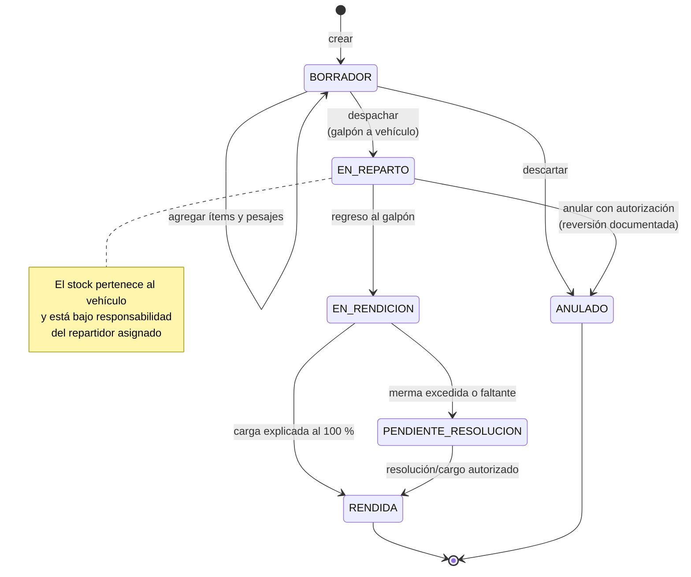

## 14.2 Ciclo de vida de la jornada del vehículo

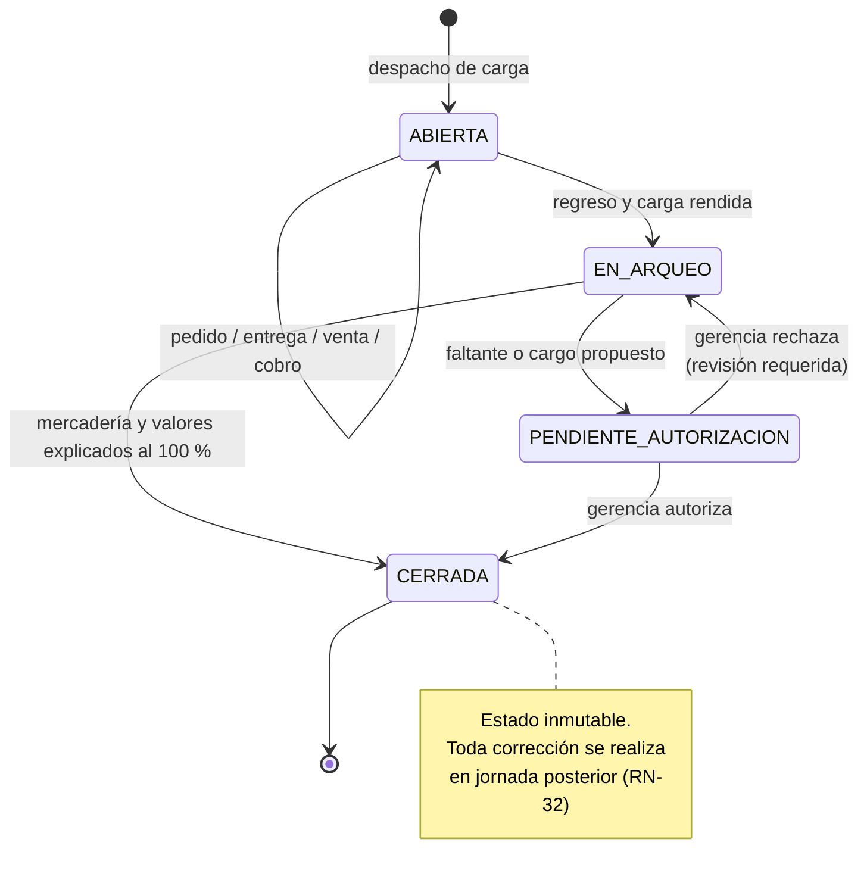

## 14.3 Ciclo de vida de la discrepancia

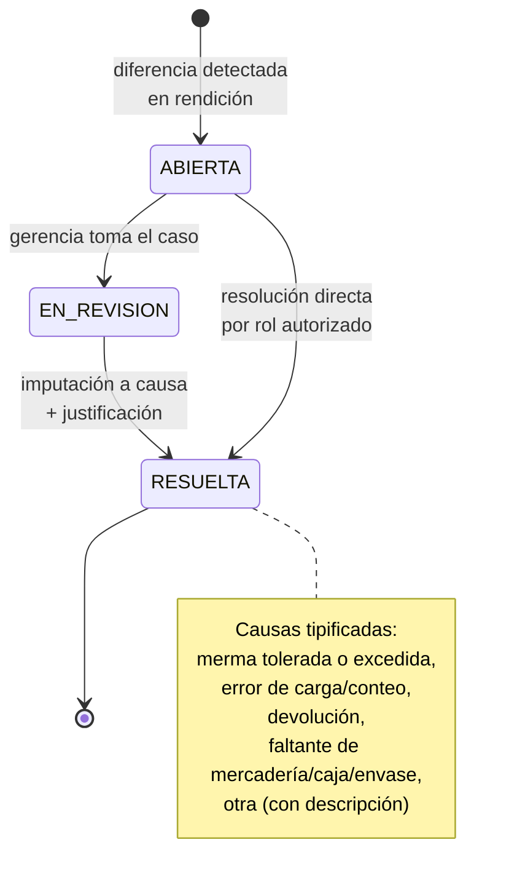

---

# 15. Seguridad y control de acceso

## 15.1 Modelo de autenticación y autorización

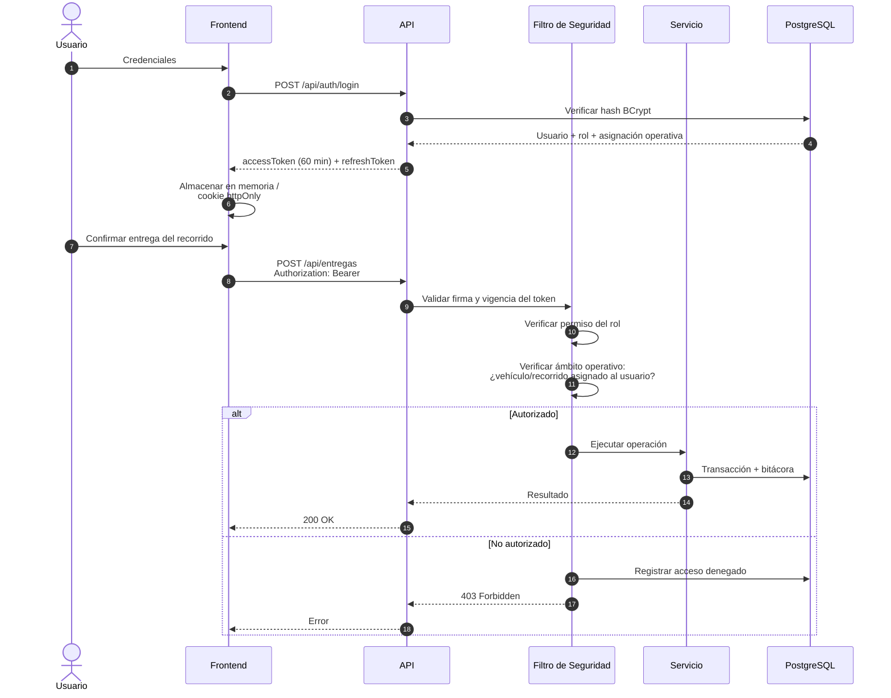

## 15.2 Matriz de amenazas y controles

| Amenaza | Vector | Control implementado | Requisito |
|---|---|---|---|
| Acceso no autorizado a datos de otro vehículo/recorrido | Manipulación de identificadores en la URL (*IDOR*) | Verificación de asignación de vehículo y recorrido en el servidor | RNF-23, RN-42 |
| Escalamiento de privilegios | Alteración del token o del cliente | Firma criptográfica del JWT; autorización siempre del lado del servidor | RNF-22, RNF-23 |
| Fuerza bruta sobre credenciales | Automatización sobre el endpoint de login | Limitación de tasa; bloqueo temporal tras intentos fallidos | RNF-25 |
| Inyección SQL | Entrada no sanitizada | Consultas parametrizadas; ORM; validación de entrada | RNF-24 |
| Repudio de una operación | Uso de credenciales compartidas | Credenciales individuales obligatorias; bitácora inmutable | RN-41, RN-44 |
| Manipulación de inventario | Ajuste manual malicioso | Autorización superior obligatoria; motivo requerido; registro auditable | RN-40 |
| Ocultamiento de faltantes | Rendición declarando lo esperado sin pesar/contar | Captura de ticadora, ecuación del 100 %, segregación de funciones y bitácora | RN-14, RN-19, RN-20 |
| Manipulación de lecturas de peso | Reutilización o carga manual injustificada | Identificador externo único; fuente de lectura; motivo obligatorio; auditoría | RF-131 a RF-133, RN-19 |
| Alteración de saldos de clientes | Edición directa del saldo | Libro mayor de movimientos; ajustes autorizados; sin borrado histórico | RF-705, RF-707, RN-37 |
| Exposición de credenciales | Secretos versionados en el repositorio | Gestión exclusiva por variables de entorno; análisis del repositorio | RNF-27 |
| Interceptación de tráfico | Red no confiable | TLS obligatorio extremo a extremo | RNF-20 |

## 15.3 Tratamiento de datos personales

De aplicarse el registro de datos de clientes, el sistema se ajustará a la **Ley N.º 25.326**, observando los principios de finalidad, minimización de la recolección, y garantía de los derechos de acceso, rectificación y supresión. El MVP limita la recolección de datos personales a los usuarios internos del sistema y, en su caso, a los datos identificatorios mínimos de clientes mayoristas.

---

# 16. Infraestructura, despliegue y operación

## 16.1 Topología de despliegue

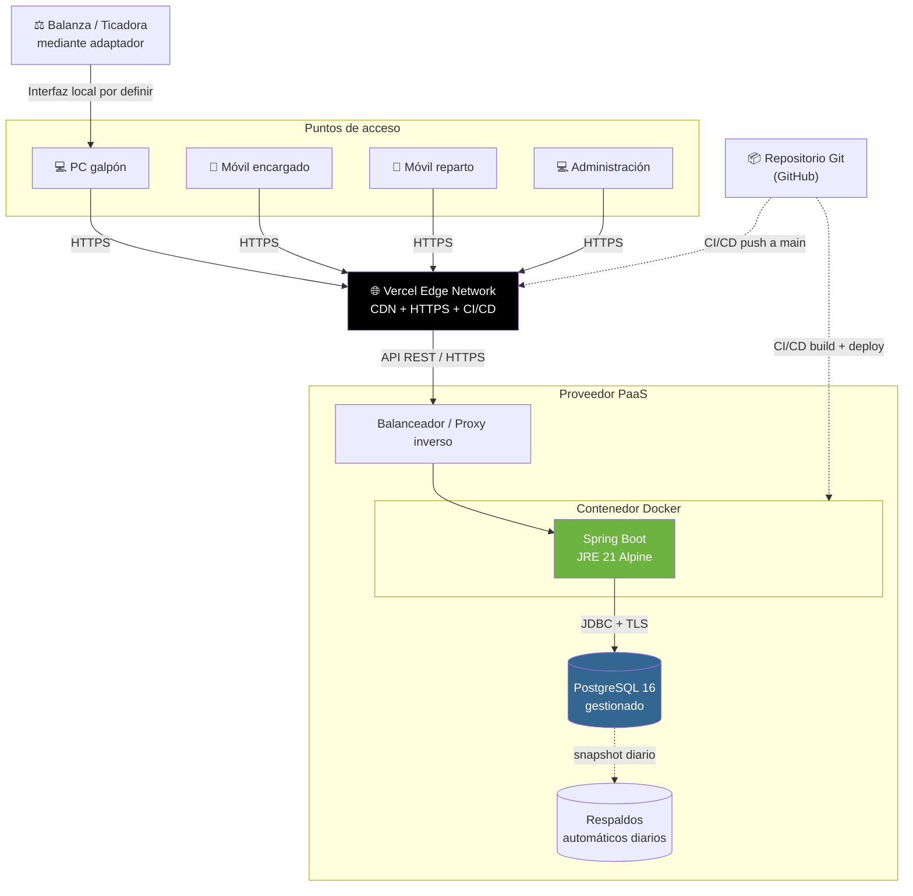

## 16.2 Estrategia de entornos

| Entorno | Propósito | Infraestructura | Datos |
|---|---|---|---|
| **Local** | Desarrollo individual | Docker Compose (API + PostgreSQL + Adminer) | Datos sintéticos de prueba |
| **Staging** | Validación funcional con usuarios clave | Réplica reducida en el PaaS | Datos anonimizados o sintéticos |
| **Producción** | Operación real | PaaS con base gestionada y respaldos | Datos reales |

La **paridad entre entornos** se garantiza mediante contenerización (RNF-41): el mismo artefacto de imagen se promueve entre entornos, variando exclusivamente la configuración inyectada por variables de entorno.

## 16.3 Composición del entorno de desarrollo

```yaml
# docker-compose.yml — entorno local de desarrollo
services:
  db:
    image: postgres:16-alpine
    environment:
      POSTGRES_DB: pollito_casero
      POSTGRES_USER: ${DB_USER}
      POSTGRES_PASSWORD: ${DB_PASSWORD}
    ports: ["5432:5432"]
    volumes: ["pgdata:/var/lib/postgresql/data"]
    healthcheck:
      test: ["CMD-SHELL", "pg_isready -U ${DB_USER}"]
      interval: 10s
      retries: 5

  api:
    build: ./backend
    depends_on:
      db: { condition: service_healthy }
    environment:
      SPRING_DATASOURCE_URL: jdbc:postgresql://db:5432/pollito_casero
      SPRING_PROFILES_ACTIVE: dev
      JWT_SECRET: ${JWT_SECRET}
    ports: ["8080:8080"]

volumes:
  pgdata:
```

## 16.4 Pipeline de integración y despliegue continuo

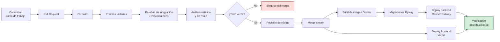

## 16.5 Plan de implantación

| Fase | Duración estimada | Actividades | Criterio de avance |
|---|---|---|---|
| **F1 — Preparación** | 1 semana | Carga de maestros (productos, galpón, vehículos, clientes y usuarios), configuración de parámetros | Datos maestros validados por gerencia |
| **F2 — Piloto** | 2 semanas | Operación en el galpón y **un vehículo**, en paralelo con papel/cuaderno | Coincidencia entre carga, entregas, rendición digital y respaldo físico en ≥ 95 % de los casos |
| **F3 — Capacitación** | 1 semana | Formación por rol; entrega de guías rápidas de una página por puesto | Todos los usuarios operativos capacitados |
| **F4 — Despliegue progresivo** | 2-3 semanas | Incorporación de vehículos de a uno, con acompañamiento | Cada vehículo opera una semana sin incidentes bloqueantes |
| **F5 — Corte del proceso manual** | — | Discontinuación del remito en papel como registro primario | Estabilidad sostenida durante dos semanas |
| **F6 — Estabilización** | 4 semanas | Soporte reforzado, corrección de defectos, ajuste de parámetros | Tasa de incidentes decreciente |

> **Criterio de reversibilidad:** durante F2 y F4 el proceso en papel se mantiene activo como respaldo. La discontinuación solo se ejecuta sobre evidencia de estabilidad, nunca sobre expectativa.

## 16.6 Observabilidad

| Aspecto | Implementación en el MVP |
|---|---|
| Logs de aplicación | Estructurados, con nivel de severidad y correlación por petición |
| Estado del servicio | Endpoint `/actuator/health` con verificación de conectividad a base de datos |
| Métricas | Exposición de métricas de aplicación vía Spring Boot Actuator |
| Alertas | Notificación por correo ante caída del servicio y ante errores 5xx recurrentes |
| Monitoreo de negocio | Panel de discrepancias, vehículos sin rendir, cargos pendientes y saldos de cuentas corrientes (RF-410, RF-503, RF-510, RF-511) |

---

# 17. Estrategia de pruebas y calidad

## 17.1 Pirámide de pruebas

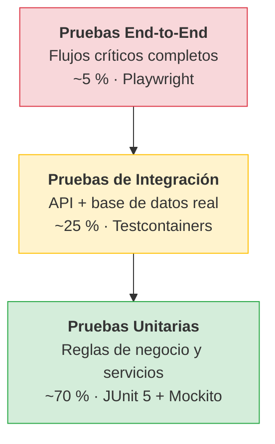

## 17.2 Casos de prueba críticos

| ID | Escenario | Resultado esperado | Requisito verificado |
|---|---|---|---|
| TC-01 | Despacho de una carga que excede el stock del galpón | Rechazo con mensaje explícito; ningún movimiento persistido | RF-104, RN-11 |
| TC-02 | Rendición de 97 kg explicados sobre 100 kg cargados | Merma de 3 % registrada como tolerada; sin cargo automático | RF-414, RF-415, RN-16 |
| TC-03 | Rendición de 96,9 kg explicados sobre 100 kg cargados | Merma superior a 3 %; discrepancia imputable y revisión obligatoria | RF-415, RF-416, RN-22 |
| TC-04 | Fallo de base de datos a mitad del despacho | *Rollback* completo; el stock de origen permanece inalterado | RNF-13, RN-11 |
| TC-05 | Reenvío de la misma confirmación de entrega por reintento | Una única entrega/venta registrada; sin duplicación de movimientos | RNF-14 |
| TC-06 | Registro de venta sin jornada abierta para vehículo/repartidor | Rechazo con mensaje orientado a la acción | RF-301, RN-30 |
| TC-07 | Anulación de venta | Reversión de stock y de caja; venta en estado `ANULADA`, no eliminada | RF-307, RN-34 |
| TC-08 | Arqueo con faltante de efectivo | Diferencia inmutable, cargo pendiente al repartidor y autorización gerencial | RF-408, RF-417, RN-36 |
| TC-09 | Acceso de un repartidor a datos de otro vehículo mediante manipulación de URL | Respuesta 403; registro del intento en bitácora | RNF-23, RN-42 |
| TC-10 | Intento de modificación de un registro de auditoría | Operación inexistente; no hay endpoint ni permiso que la habilite | RF-603, RN-44 |
| TC-11 | Verificación del invariante de conservación tras una serie de operaciones | Stock galpón + stock vehículos = suma algebraica de movimientos | RN-04 |
| TC-12 | Modificación de la lista de precios posterior a una venta | El importe de la venta histórica permanece inalterado | RF-310, RN-33 |
| TC-13 | Intento de edición de un remito ya despachado | Rechazo | RF-108, RN-10 |
| TC-14 | Apertura de una segunda jornada para el mismo vehículo o repartidor | Rechazo | RF-401, RN-31 |
| TC-15 | Ingesta duplicada del mismo identificador de ticadora | Rechazo de la segunda imputación; una sola lectura persistida | RF-131, RN-19 |
| TC-16 | Ticadora indisponible y peso ingresado manualmente | Registro aceptado solo con motivo, usuario y fuente `MANUAL` | RF-133, RN-19 |
| TC-17 | Venta mayorista a cuenta corriente | Débito vinculado a venta, cliente, vehículo y repartidor; sin incremento de efectivo esperado | RF-702, RN-38, RN-39 |
| TC-18 | Cobranza posterior mediante transferencia | Crédito en cuenta, referencia de transferencia y saldo actualizado | RF-703 a RF-706 |
| TC-19 | Intento de registrar tarjeta de débito o crédito | Rechazo por medio de pago no admitido | RF-306, RN-35 |
| TC-20 | Cierre con 100 % de mercadería y ventas explicadas | Jornada `CERRADA`; resumen por vehículo disponible | RF-413, RF-419, RN-20, RN-39 |
| TC-21 | Cierre con mercadería o ventas sin explicar | Cierre bloqueado hasta devolución, merma, cobro, cuenta corriente o cargo autorizado | RF-419, RN-20, RN-39 |

## 17.3 Criterios de aceptación del MVP

El MVP se considera apto para producción cuando se verifiquen simultáneamente:

1. La totalidad de los requisitos de prioridad `M` implementados y verificados.
2. Los veintiún casos de prueba críticos superados.
3. Cobertura de pruebas de la capa de dominio no inferior al 70 %.
4. Prueba de carga con 30 usuarios concurrentes dentro de los umbrales de RNF-01 a RNF-03.
5. Ausencia de defectos abiertos de severidad crítica o alta.
6. Procedimiento de restauración desde respaldo ejecutado y verificado al menos una vez.
7. Documentación de usuario por rol entregada.

---

# 18. Plan de trabajo

## 18.1 Descomposición en iteraciones

Se adopta un enfoque **iterativo e incremental**, con incrementos funcionalmente completos y desplegables.

| Sprint | Foco | Entregable verificable |
|:--:|---|---|
| **0** | Infraestructura y andamiaje | Repositorio, Docker Compose operativo, esquema inicial, pipeline de CI, esqueleto de ambas aplicaciones |
| **1** | Identidad y maestros | Autenticación JWT, usuarios, roles, galpón, vehículos, productos y clientes; matriz de permisos operativa |
| **2** | Núcleo de inventario | Stock en galpón y vehículos, movimientos, ajustes, kardex; invariante de conservación verificado |
| **3** | Pesaje, cargas y remitos | Prueba de ticadora, adaptador, lecturas, armado de carga, impresión A4 y despacho |
| **4** | Reparto móvil | Pedidos, asignación de recorrido, confirmación de entrega/no entrega y devoluciones |
| **5** | Comercial y cuentas corrientes | Ventas, precios, efectivo/cheque/transferencia, débitos, cobranzas y extractos |
| **6** | Rendición y caja vehicular | Conciliación de carga, merma 3 %, cajas retornables, arqueo y cargos al repartidor |
| **7** | Consolidación y reportes | Tablero por vehículo, flujo de caja, cuentas corrientes, mermas, cargos y exportaciones |
| **8** | Endurecimiento | Auditoría completa, pruebas de carga, revisión de seguridad, corrección de defectos |
| **9** | Implantación | Carga de maestros reales, capacitación y piloto en el galpón con un vehículo |

## 18.2 Cronograma

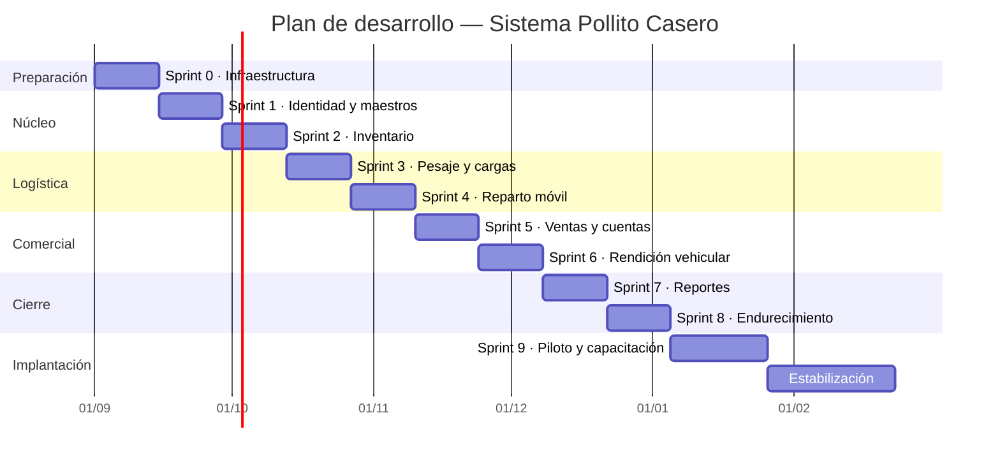

> El cronograma expresa **duraciones relativas y secuencia de dependencias**. Las fechas absolutas deben ajustarse a la disponibilidad horaria real del equipo y al calendario académico, sin alterar el orden de precedencia: ningún sprint de la sección Logística puede iniciarse antes de completar el núcleo de inventario, dado que toda la lógica de remitos se apoya sobre los movimientos de stock.

## 18.3 Dependencias críticas

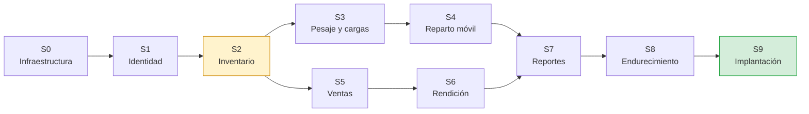

El **Sprint 2 constituye el camino crítico**: tanto el módulo logístico como el comercial dependen del núcleo de inventario. Toda demora en este sprint se propaga íntegramente al resto del plan.

---

# 19. Gestión de riesgos

| ID | Riesgo | Prob. | Impacto | Exposición | Estrategia de mitigación |
|---|---|:--:|:--:|:--:|---|
| RG-01 | La red móvil o el servicio falla durante los recorridos y obliga a operar con papel/cuaderno | Alta | Alto | **Alta** | Procedimiento de contingencia, identificadores físicos, carga diferida idempotente y conservación local del formulario. |
| RG-02 | Resistencia del personal a abandonar el proceso en papel | Alta | Alto | **Alta** | Involucrar usuarios clave en la validación; interfaz de mínima fricción; convivencia con el papel durante el piloto; capacitación por rol. |
| RG-03 | Las definiciones aún pendientes de la Sección 5 afectan el diseño | Media | Alto | **Alta** | Resolver SUP-03, SUP-06, SUP-07, SUP-17 y SUP-18 antes del sprint que los consume; parametrizar políticas volátiles. |
| RG-04 | Alcance creciente por incorporación de requisitos durante el desarrollo | Alta | Medio | **Media** | Exclusiones explícitas documentadas (Sección 4.2); todo requisito nuevo ingresa al roadmap post-MVP, no al MVP. |
| RG-05 | Limitaciones de la capa gratuita de infraestructura (suspensión por inactividad, cuotas) | Media | Medio | **Media** | Verificar límites en el Sprint 0; presupuestar el plan de entrada del PaaS antes de la implantación productiva. |
| RG-06 | Pérdida de datos por fallo de infraestructura | Baja | Crítico | **Media** | Respaldos diarios automatizados; verificación periódica de restauración; procedimiento documentado. |
| RG-07 | Superposición del cronograma del proyecto con obligaciones académicas | Alta | Medio | **Media** | Sprints con entregables autocontenidos; priorización estricta por MoSCoW; el alcance `M` es el compromiso, `S` y `C` son elásticos. |
| RG-08 | Carga inicial de productos, clientes, saldos y vehículos incompleta o errónea | Media | Alto | **Media** | Fase F1 dedicada a maestros y conciliación de saldos iniciales, con validación formal antes del piloto. |
| RG-09 | Uso de credenciales compartidas en la práctica, anulando la trazabilidad | Media | Alto | **Media** | Credenciales individuales obligatorias por diseño; reporte gerencial de operaciones por usuario; comunicación explícita de la política. |
| RG-10 | Curva de aprendizaje de Spring Boot superior a la estimada | Media | Medio | **Media** | Sprint 0 con prueba de concepto técnica; documentación de referencia; posibilidad de replantear el stack antes del Sprint 1, no después. |
| RG-11 | La ticadora no expone una interfaz utilizable o su protocolo no es documentado | Media | Alto | **Alta** | Relevar marca/modelo y ejecutar prueba técnica antes del Sprint 3; encapsular integración; habilitar captura manual auditada. |
| RG-12 | Los saldos iniciales de cuentas corrientes no coinciden con los cuadernos/boletas | Alta | Alto | **Alta** | Acta de saldo inicial por cliente, importación controlada y reporte de diferencias antes de habilitar nuevas ventas a crédito. |
| RG-13 | Los cargos a repartidores generan controversia por fórmula o autorización | Media | Alto | **Alta** | Resolver SUP-18, conservar cálculo físico y evidencia, separar cargo de liquidación de haberes y exigir autorización gerencial. |

---

# 20. Matriz de trazabilidad

Vinculación entre la problemática identificada, los objetivos, los requisitos y su verificación.

| Problema | Objetivo | Requisitos principales | Reglas | Casos de prueba |
|---|---|---|---|---|
| P-01 Desfasajes de inventario por vehículo | OE-02, OE-03 | RF-107, RF-118, RF-120, RF-127, RF-200 a RF-218, RF-414 a RF-419 | RN-01 a RN-04, RN-12 a RN-25 | TC-01 a TC-03, TC-11, TC-20, TC-21 |
| P-02 Fricción administrativa en reparto | OE-01, OE-09 | RF-100 a RF-134, RF-313 a RF-315 | RN-10 a RN-25 | TC-04, TC-05, TC-13, TC-15, TC-16 |
| P-03 Opacidad financiera por repartidor | OE-05, OE-06 | RF-400 a RF-419, RF-500 a RF-511 | RN-30 a RN-40 | TC-06, TC-08, TC-14, TC-20, TC-21 |
| P-04 Ausencia de auditabilidad | OE-07 | RF-600 a RF-604 | RN-41, RN-43, RN-44 | TC-09, TC-10 |
| P-05 Volatilidad del conocimiento | OE-01, OE-07 | RF-101, RF-117, RF-124, RF-130, RF-601 | RN-02, RN-15, RN-19, RN-46 | TC-05, TC-10, TC-16 |
| P-06 Imposibilidad de métricas | OE-06 | RF-214, RF-501, RF-505 a RF-511 | RN-01, RN-37 | TC-11, TC-12, TC-18 |
| P-07 Cuentas corrientes no sistematizadas | OE-06 | RF-700 a RF-708, RF-511 | RN-37 a RN-39 | TC-17, TC-18 |
| P-08 Captura de peso desacoplada | OE-09 | RF-103, RF-129 a RF-134 | RN-16, RN-19 | TC-02, TC-03, TC-15, TC-16 |

---

# 21. Evolución futura (post-MVP)

## 21.1 Roadmap por horizontes

```mermaid
timeline
    title Evolución del sistema Pollito Casero
    section Horizonte 1 · Consolidación
        Aplicación web progresiva (PWA) con operación offline : Impresión de comprobantes optimizada : Lectura de código de barras o QR en carga : Notificaciones push a encargados
    section Horizonte 2 · Extensión funcional
        Facturación electrónica ARCA/AFIP : Límites de crédito y vencimientos : Trazabilidad por lote y control sanitario : Módulo de compras y proveedores
    section Horizonte 3 · Inteligencia de negocio
        Tablero analítico de estacionalidad : Predicción de demanda por vehículo/zona : Planificación de producción en granja : Optimización de rutas de reparto
```

## 21.2 Preparación arquitectónica para la evolución

Las siguientes decisiones del MVP anticipan deliberadamente la evolución, sin incurrir en su costo presente:

| Capacidad futura | Preparación incorporada en el MVP |
|---|---|
| Multi-galpón / depósitos adicionales | Entidad `UBICACION` genérica con discriminador de tipo; las cargas referencian ubicaciones y vehículos, no roles fijos |
| Facturación electrónica | Estructura de venta e ítems con los campos requeridos por el comprobante fiscal; medio de pago desagregado |
| Trazabilidad por lote | Movimientos de stock y lecturas de peso con referencia a documento, extensibles a lote tras resolver SUP-03 |
| Predicción de demanda | Serie histórica de ventas y movimientos capturada íntegramente desde el primer día de operación |
| Extracción a servicios independientes | Modularización interna estricta con fronteras explícitas entre módulos |
| Operación offline | Idempotencia en escrituras críticas ya implementada; el cliente puede evolucionar a cola de sincronización |
| Gestión avanzada de crédito | El libro mayor de cuentas corrientes admite incorporar vencimientos, límites, intereses y alertas sin reemplazar movimientos históricos |

---

# 22. Anexos

## Anexo A — Resultado del relevamiento y asuntos pendientes

### A.1 Hechos confirmados por el cliente

| Tema relevado | Respuesta confirmada | Incorporación en la especificación |
|---|---|---|
| Conectividad | Granja sin internet; galpón con internet | Galpón como origen sistémico; RES-08; ADR-05 |
| Unidades | Se opera por cajas y kilos | SUP-01; RF-102 a RF-103 |
| Puntos de venta | No hay sucursales físicas; los vehículos cumplen esa función | Secciones 4 y 6; ADR-04 |
| Volumen operativo | Salen entre cinco y siete camionetas; inicio aproximado a las 05:00; seis repartidores habituales | RNF-10; planificación de capacidad y maestros |
| Remitos | Se llenan en el galpón; queda copia en galpón y cliente | RF-100, RF-128 |
| Control de peso | Balanza con ticadora que entrega/imprime kilos | RF-129 a RF-134; ADR-07 |
| Merma | En el ejemplo del cliente, hasta 3 kg por cada 100 kg es tolerable | SUP-08; RN-16; RF-414 a RF-416 |
| Faltantes | Se descuentan al repartidor; la causa se evalúa tras el control de peso | RF-416 a RF-418; RN-22 y RN-23 |
| Entregas | El repartidor debe confirmar entrega/no entrega; lo no entregado vuelve | RF-110 a RF-118; RN-25 |
| Caja | Cada repartidor es cajero de su vehículo y rinde al regreso | SUP-15; RF-400 a RF-419 |
| Medios de pago | Efectivo, cheque y transferencia; no se usan débito ni crédito | SUP-12; RF-306; RN-35 |
| Cuenta corriente | La mayoría de los clientes mayoristas opera a cuenta corriente | SUP-13; RF-700 a RF-708 |
| Dispositivos | Celular para repartidores; computadora en galpón; celular opcional para encargado | SUP-10; RNF-30 a RNF-32 |
| Usuarios | Credenciales individuales para evitar operaciones mezcladas | SUP-11; RN-41 |
| Contingencia | Ante caída se continúa manualmente y se carga luego | RN-46; RNF-17 y RNF-18 |
| Envases | Se controlan las cajas entregadas y devueltas por clientes | RF-216, RF-217 y RF-418 |

### A.2 Definiciones pendientes de confirmación

1. Lista y cantidad exacta de SKU actuales (SUP-02).
2. Necesidad de trazabilidad por lote o fecha de faena (SUP-03).
3. Política definitiva ante sobrantes de mercadería (SUP-05).
4. Confirmación expresa de la inmutabilidad/anulación del remito despachado (SUP-06).
5. Confirmación del instante contable del descuento de stock (SUP-07).
6. Presupuesto mensual admisible y nivel de servicio contratado (SUP-16).
7. Marca, modelo, protocolo, conexión y formato de la balanza/ticadora (SUP-17).
8. Base de valuación del cargo al repartidor: costo, precio de venta u otro valor (SUP-18).
9. Reglas de vencimiento, límite de crédito e intereses de cuentas corrientes; quedan fuera del MVP hasta su relevamiento.

> La fotografía de un remito completo y la planilla/cuaderno real de cierre no fueron provistas entre los archivos de entrada. Deben incorporarse como evidencia antes del diseño definitivo de pantallas y migración de datos.

## Anexo B — Convención de endpoints de la API

| Método | Recurso | Descripción |
|---|---|---|
| `POST` | `/api/auth/login` | Autenticación |
| `POST` | `/api/auth/refresh` | Renovación de token |
| `GET` | `/api/cargas` | Listado filtrable por vehículo, repartidor, fecha y estado |
| `POST` | `/api/cargas` | Creación de carga en estado borrador |
| `PUT` | `/api/cargas/{id}/items` | Modificación de ítems (solo en borrador) |
| `POST` | `/api/cargas/{id}/pesajes` | Asociación idempotente de lectura de ticadora o captura manual |
| `POST` | `/api/cargas/{id}/despachar` | Transferencia atómica de galpón a vehículo |
| `POST` | `/api/cargas/{id}/rendir` | Conciliación de cajas, kg, devoluciones, merma y faltantes |
| `POST` | `/api/cargas/{id}/anular` | Anulación autorizada con movimientos compensatorios |
| `GET` | `/api/discrepancias` | Listado filtrable por estado |
| `POST` | `/api/discrepancias/{id}/resolver` | Imputación a causa y cierre |
| `GET` | `/api/stock` | Saldos por ubicación y producto |
| `GET` | `/api/stock/kardex` | Histórico de movimientos |
| `POST` | `/api/stock/ajustes` | Ajuste manual con motivo |
| `POST` | `/api/ventas` | Registro de operación comercial |
| `POST` | `/api/ventas/{id}/anular` | Anulación con reversión |
| `POST` | `/api/entregas` | Confirmación de entrega total, parcial o no entrega |
| `POST` | `/api/jornadas-vehiculo` | Apertura de jornada por vehículo/repartidor |
| `POST` | `/api/jornadas-vehiculo/{id}/movimientos` | Movimiento no comercial autorizado |
| `POST` | `/api/jornadas-vehiculo/{id}/arqueo` | Rendición de efectivo, cheques y transferencias |
| `POST` | `/api/jornadas-vehiculo/{id}/cerrar` | Validación del 100 % y cierre |
| `POST` | `/api/cargos-repartidor` | Propuesta de cargo por merma, caja o envases |
| `POST` | `/api/cargos-repartidor/{id}/autorizar` | Resolución gerencial del cargo |
| `GET` | `/api/clientes/{id}/cuenta-corriente` | Saldo y extracto del cliente |
| `POST` | `/api/cuentas-corrientes/{id}/cobranzas` | Registro de cobranza e imputación a documentos |
| `POST` | `/api/cuentas-corrientes/{id}/ajustes` | Ajuste autorizado sin borrar historia |
| `GET` | `/api/reportes/consolidado` | Tablero gerencial |
| `GET` | `/api/auditoria` | Consulta de bitácora |

**Convenciones:** respuestas en JSON; códigos HTTP semánticos (`200`, `201`, `400`, `401`, `403`, `404`, `409` para conflictos de estado, `422` para violación de regla de negocio); errores con estructura uniforme (código, mensaje, detalle); paginación por parámetros `page` y `size`.

## Anexo C — Motivos tipificados

**Causas de discrepancia de carga:** merma tolerada · merma excedida · error de carga en galpón · error de lectura de peso · error de conteo al regreso · mercadería no entregada · devolución por defecto de faena/calidad · faltante no justificado · sobrante · otra (con descripción obligatoria).

**Tipos de ajuste de stock:** corrección por conteo físico · merma por deterioro · merma por vencimiento · decomiso · consumo interno · corrección de error de carga.

**Tipos de movimiento de caja:** ingreso extraordinario · retiro a caja general · gasto operativo autorizado · corrección referenciada.

**Causas de cargo al repartidor:** merma superior a tolerancia · faltante de mercadería · faltante de efectivo/valores · caja/cajón retornable no devuelto.

**Tipos de movimiento de cuenta corriente:** débito por venta · crédito por cobranza en efectivo · crédito por cheque · crédito por transferencia · ajuste autorizado.

---

## Cierre del documento

Este documento constituye la **línea base 2.0** de la especificación del sistema Pollito Casero, actualizada con la entrevista de relevamiento del 25 de agosto de 2026. Los hechos confirmados se incorporan como requisitos y reglas verificables; las decisiones no respondidas permanecen identificadas en la Sección 5 y el Anexo A. Toda modificación posterior se gestionará mediante control de cambios, actualizando el registro de versiones, los casos de prueba y la matriz de trazabilidad.

**Elaborado por:** Mauro — Tecnicatura Universitaria en Programación, UTN
**Fecha:** 24 de agosto de 2026
**Versión:** 1.0
