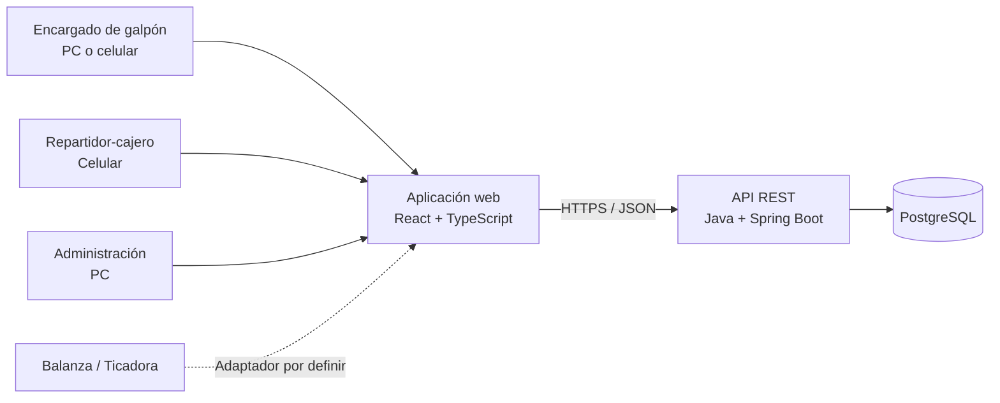

# Pollito Casero

Sistema de gestión logística, comercial y de inventario para digitalizar la operación de **Pollito Casero**, desde la preparación de mercadería en el galpón hasta la entrega, venta y rendición de cada vehículo de reparto.

> **Estado del proyecto:** análisis y diseño funcional. La aplicación todavía no posee una versión ejecutable.

## Descripción

Pollito Casero es un proyecto desarrollado como **Trabajo Final Integrador (TFI)** de la Tecnicatura Universitaria en Programación de la Universidad Tecnológica Nacional (UTN).

El sistema busca reemplazar registros distribuidos entre remitos en papel, cuadernos y mensajería instantánea por una fuente de información centralizada, trazable y auditable.

La operación relevada no utiliza sucursales físicas: cada vehículo funciona como punto de venta móvil y cada repartidor es responsable tanto de la mercadería transportada como de la caja de su recorrido. Debido a que la granja no dispone de conexión a internet, el galpón actúa como origen operativo de los datos del sistema.

## Objetivos

- Digitalizar las cargas y los remitos emitidos desde el galpón.
- Controlar la mercadería simultáneamente por cajas y kilogramos.
- Integrar las lecturas de la balanza y la ticadora al proceso de carga.
- Mantener el inventario del galpón y de cada vehículo.
- Registrar pedidos, entregas, ventas y cobranzas desde dispositivos móviles.
- Realizar arqueos y rendiciones independientes por vehículo y repartidor.
- Controlar devoluciones, cajas retornables, mermas y faltantes.
- Gestionar las cuentas corrientes de clientes mayoristas.
- Proporcionar trazabilidad y reportes consolidados para la administración.

## Alcance funcional previsto

### Cargas, remitos y pesaje

- Preparación de cargas en el galpón.
- Registro de productos por cajas y kilogramos.
- Asociación de lecturas provenientes de la balanza/ticadora.
- Asignación de vehículo, repartidor y recorrido.
- Emisión de remitos y comprobantes internos en formato A4.

### Inventario

- Stock disponible en el galpón.
- Stock transportado por cada vehículo.
- Movimientos de inventario inmutables y auditables.
- Devoluciones, ajustes, conteos y mermas.
- Control de cajas, cajones y envases retornables.

### Reparto y ventas móviles

- Carga de pedidos desde el celular.
- Confirmación de entregas totales, parciales o no realizadas.
- Registro de ventas con efectivo, cheque o transferencia.
- Conservación de la mercadería no entregada en el stock del vehículo.
- Identificación individual de cada operación por usuario.

### Rendición y caja por vehículo

- Jornada independiente por fecha, vehículo y repartidor.
- Conciliación de ventas contra efectivo, cheques y transferencias.
- Control del total de mercadería cargada, entregada y devuelta.
- Registro de faltantes y cargos autorizados al repartidor.
- Rendición obligatoria del 100 % de la carga y de las ventas realizadas.

### Cuentas corrientes

- Registro de clientes mayoristas.
- Débitos automáticos por ventas a cuenta corriente.
- Registro de cobranzas y su medio de pago.
- Consulta de saldos y extractos cronológicos.
- Ajustes autorizados sin eliminación del historial.

### Administración y auditoría

- Usuarios, roles y permisos por ámbito operativo.
- Gestión de productos, vehículos y parámetros del negocio.
- Reportes por vehículo, repartidor, cliente y período.
- Bitácora inmutable de operaciones relevantes.

## Reglas de negocio principales

- El galpón constituye el origen de los datos operativos del MVP.
- Cada vehículo representa una ubicación de stock, un punto de venta móvil y una caja independiente.
- El repartidor es responsable de la carga y de los valores asignados a su recorrido.
- La tolerancia inicial de merma es del **3 % del peso cargado por recorrido**.
- Toda merma debe registrarse, incluso cuando se encuentre dentro de la tolerancia.
- Una merma superior a la tolerancia o un faltante de caja requiere revisión y puede originar un cargo autorizado.
- El cierre solo puede completarse cuando el 100 % de la mercadería y de las ventas se encuentre explicado.
- Los únicos medios de pago contemplados inicialmente son efectivo, cheque y transferencia.
- La cuenta corriente es una condición de venta y no constituye un ingreso de efectivo hasta que se registra la cobranza.
- Cada usuario debe operar con credenciales individuales e intransferibles.

## Arquitectura prevista

Se propone una aplicación web responsiva basada en un **monolito modular**, con separación entre presentación, aplicación, dominio e infraestructura.



La comunicación técnica con la ticadora se encuentra pendiente de validación de marca, modelo y protocolo. La arquitectura contempla un adaptador reemplazable y una captura manual auditada como contingencia.

## Tecnologías planificadas

| Capa | Tecnología prevista |
|---|---|
| Frontend | React, TypeScript, Vite y Tailwind CSS |
| Backend | Java 21 y Spring Boot 3 |
| Persistencia | PostgreSQL 16 |
| Seguridad | Spring Security, JWT y BCrypt |
| Documentación de API | OpenAPI 3 |
| Migraciones | Flyway o Liquibase |
| Contenedores | Docker y Docker Compose |
| Pruebas backend | JUnit 5, Mockito y Testcontainers |
| Pruebas end-to-end | Playwright |
| Despliegue previsto | Vercel para frontend y Render/Railway para backend |

> Las tecnologías enumeradas representan la arquitectura planificada y pueden ajustarse antes de comenzar la implementación.

## Estructura prevista del repositorio

```text
pollito-casero/
├── frontend/                  # Aplicación web responsiva
├── backend/                   # API REST y reglas de negocio
├── docs/                      # SRS, arquitectura y documentación técnica
├── .github/
│   └── workflows/             # Integración continua
├── docker-compose.yml         # Entorno local
└── README.md
```

Esta estructura es orientativa y se incorporará progresivamente durante los primeros sprints.

## Puesta en marcha

Actualmente el repositorio se encuentra en la etapa de análisis y diseño, por lo que todavía no existe una aplicación que pueda instalarse o ejecutarse.

Cuando esté disponible el primer incremento funcional, esta sección deberá incluir como mínimo:

1. Requisitos de software y versiones compatibles.
2. Clonado del repositorio.
3. Variables de entorno necesarias.
4. Creación de la base de datos.
5. Ejecución mediante Docker Compose.
6. Acceso al frontend, la API y la documentación OpenAPI.
7. Carga de datos iniciales para desarrollo.

## Roadmap inicial

- [x] Relevamiento inicial con el responsable del negocio.
- [x] Especificación de requisitos de software v2.0.
- [x] Definición preliminar de arquitectura y modelo de dominio.
- [ ] Inicialización del repositorio y entornos de desarrollo.
- [ ] Autenticación, usuarios, roles y datos maestros.
- [ ] Inventario del galpón y de los vehículos.
- [ ] Integración de pesaje, cargas y remitos.
- [ ] Pedidos, entregas y ventas móviles.
- [ ] Cuentas corrientes y cobranzas.
- [ ] Rendición de cargas y arqueo por vehículo.
- [ ] Reportes, auditoría y observabilidad.
- [ ] Pruebas integrales, piloto e implantación progresiva.

## Documentación

La especificación funcional y arquitectónica de referencia es:

- **PC-SRS-001 — Sistema de Gestión Integral Pollito Casero, versión 2.0**.

La documentación técnica deberá mantenerse versionada dentro del directorio `docs/` a medida que avance el proyecto. Las decisiones arquitectónicas relevantes se registrarán mediante documentos ADR.

## Calidad y pruebas

La estrategia prevista combina:

- Pruebas unitarias para reglas de negocio y servicios.
- Pruebas de integración contra una base PostgreSQL real mediante Testcontainers.
- Pruebas end-to-end de los recorridos críticos.
- Validación de autorización por rol, vehículo y recorrido.
- Pruebas específicas de idempotencia, rendición de carga, merma, caja y cuenta corriente.

El objetivo inicial es alcanzar una cobertura mínima del **70 % en la capa de lógica de negocio**, sin utilizar la cobertura como sustituto de pruebas significativas.

## Seguridad

El diseño contempla:

- Comunicaciones cifradas mediante TLS.
- Contraseñas almacenadas con BCrypt.
- Autenticación mediante JWT de corta duración.
- Autorización verificada en el backend.
- Credenciales individuales por usuario.
- Bitácora de auditoría inmutable.
- Protección frente a los riesgos principales de OWASP Top 10.
- Gestión de secretos mediante variables de entorno.

## Contribuciones

El proyecto se encuentra en una etapa académica inicial. Antes de realizar cambios:

1. Crear una rama desde la rama principal.
2. Mantener los cambios enfocados y trazables a un requisito o incidencia.
3. Incorporar o actualizar las pruebas correspondientes.
4. Actualizar la documentación afectada.
5. Abrir un Pull Request con una descripción clara del problema y la solución.

Las convenciones de ramas, commits, revisión y versionado serán formalizadas al inicializar el flujo de trabajo del repositorio.

## Autor

**Mauro Ponce**  
Tecnicatura Universitaria en Programación — Universidad Tecnológica Nacional (UTN)  
Trabajo Final Integrador

## Licencia

La licencia del proyecto todavía no ha sido definida. Hasta que se incorpore un archivo `LICENSE`, no debe asumirse autorización para reutilizar, modificar o distribuir el código.
